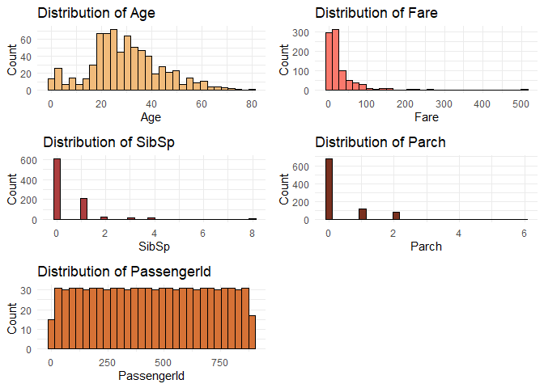
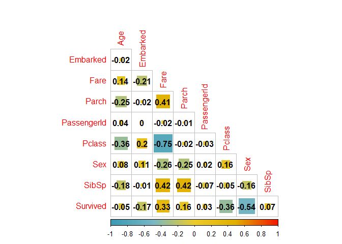
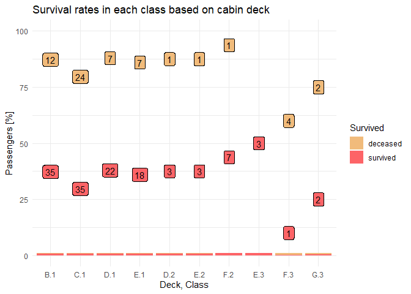
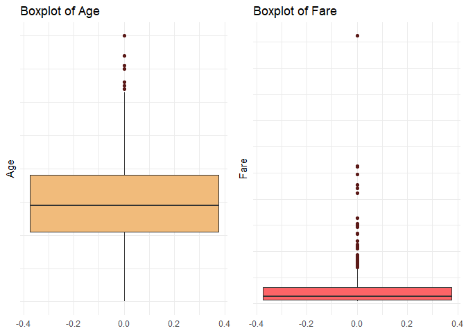

Titanic
================
Michal Rackiewicz
2023-09-29

### Load packages and data

``` r
# EDA
library(tidyverse)
library(Hmisc)
library(corrplot)
library(ggpol)
library(gridExtra)
library(rlang)
library(wesanderson)
library(knitr)

# Feature engineering
library(fastDummies)

# Models
library(caret)
```

Set seed for reproducibility

``` r
set.seed(1234)
```

Set options.

``` r
options(digits = 2,
        # do not show warning messages
        warn = -1,
        # do not user scientific number formatting
        scipen = 999)
```

Load data.

``` r
train <- read_csv("./Data/train.csv", col_types = "nffcfnnncnf")
test <- read_csv("./Data/test.csv", col_types = "nffcfnnncnf")
```

## Exploratory data analysis

First we will look at the data structures and summary statistics for
each variable.

``` r
str(train)
```

    ## spc_tbl_ [891 × 12] (S3: spec_tbl_df/tbl_df/tbl/data.frame)
    ##  $ PassengerId: num [1:891] 1 2 3 4 5 6 7 8 9 10 ...
    ##  $ Survived   : Factor w/ 2 levels "0","1": 1 2 2 2 1 1 1 1 2 2 ...
    ##  $ Pclass     : Factor w/ 3 levels "3","1","2": 1 2 1 2 1 1 2 1 1 3 ...
    ##  $ Name       : chr [1:891] "Braund, Mr. Owen Harris" "Cumings, Mrs. John Bradley (Florence Briggs Thayer)" "Heikkinen, Miss. Laina" "Futrelle, Mrs. Jacques Heath (Lily May Peel)" ...
    ##  $ Sex        : Factor w/ 2 levels "male","female": 1 2 2 2 1 1 1 1 2 2 ...
    ##  $ Age        : num [1:891] 22 38 26 35 35 NA 54 2 27 14 ...
    ##  $ SibSp      : num [1:891] 1 1 0 1 0 0 0 3 0 1 ...
    ##  $ Parch      : num [1:891] 0 0 0 0 0 0 0 1 2 0 ...
    ##  $ Ticket     : chr [1:891] "A/5 21171" "PC 17599" "STON/O2. 3101282" "113803" ...
    ##  $ Fare       : num [1:891] 7.25 71.28 7.92 53.1 8.05 ...
    ##  $ Cabin      : Factor w/ 147 levels "C85","C123","E46",..: NA 1 NA 2 NA NA 3 NA NA NA ...
    ##  $ Embarked   : chr [1:891] "S" "C" "S" "S" ...
    ##  - attr(*, "spec")=
    ##   .. cols(
    ##   ..   PassengerId = col_number(),
    ##   ..   Survived = col_factor(levels = NULL, ordered = FALSE, include_na = FALSE),
    ##   ..   Pclass = col_factor(levels = NULL, ordered = FALSE, include_na = FALSE),
    ##   ..   Name = col_character(),
    ##   ..   Sex = col_factor(levels = NULL, ordered = FALSE, include_na = FALSE),
    ##   ..   Age = col_number(),
    ##   ..   SibSp = col_number(),
    ##   ..   Parch = col_number(),
    ##   ..   Ticket = col_character(),
    ##   ..   Fare = col_number(),
    ##   ..   Cabin = col_factor(levels = NULL, ordered = FALSE, include_na = FALSE),
    ##   ..   Embarked = col_character()
    ##   .. )
    ##  - attr(*, "problems")=<externalptr>

``` r
summary(train) %>% 
  kable()
```

|     | PassengerId | Survived | Pclass | Name             | Sex        | Age        | SibSp       | Parch       | Ticket           | Fare        | Cabin          | Embarked         |
|:----|:------------|:---------|:-------|:-----------------|:-----------|:-----------|:------------|:------------|:-----------------|:------------|:---------------|:-----------------|
|     | Min. : 1    | 0:549    | 3:491  | Length:891       | male :577  | Min. : 0   | Min. :0.0   | Min. :0.0   | Length:891       | Min. : 0    | G6 : 4         | Length:891       |
|     | 1st Qu.:224 | 1:342    | 1:216  | Class :character | female:314 | 1st Qu.:20 | 1st Qu.:0.0 | 1st Qu.:0.0 | Class :character | 1st Qu.: 8  | C23 C25 C27: 4 | Class :character |
|     | Median :446 | NA       | 2:184  | Mode :character  | NA         | Median :28 | Median :0.0 | Median :0.0 | Mode :character  | Median : 14 | B96 B98 : 4    | Mode :character  |
|     | Mean :446   | NA       | NA     | NA               | NA         | Mean :30   | Mean :0.5   | Mean :0.4   | NA               | Mean : 32   | F33 : 3        | NA               |
|     | 3rd Qu.:668 | NA       | NA     | NA               | NA         | 3rd Qu.:38 | 3rd Qu.:1.0 | 3rd Qu.:0.0 | NA               | 3rd Qu.: 31 | E101 : 3       | NA               |
|     | Max. :891   | NA       | NA     | NA               | NA         | Max. :80   | Max. :8.0   | Max. :6.0   | NA               | Max. :512   | (Other) :186   | NA               |
|     | NA          | NA       | NA     | NA               | NA         | NA’s :177  | NA          | NA          | NA               | NA          | NA’s :687      | NA               |

Let us also check the distribution of the dependent variable. By doing
this we get an idea of how balanced the data set is and whether we have
to do something to balance groups before modeling.

``` r
train %>% 
  select(Survived) %>% 
  group_by(Survived) %>% 
  summarise(Count = n()) %>% 
  mutate(Freq = paste0(round(100 * Count/sum(Count), 1), "%")) %>% 
  kable()
```

| Survived | Count | Freq  |
|:---------|------:|:------|
| 0        |   549 | 61.6% |
| 1        |   342 | 38.4% |

We also want to check for missing values.

``` r
train <- train %>%
  # encode blank entries and spaces
  mutate(
    across(
      everything(),
      ~if_else(. %in% c("", " "), NA, .)
    ),
    # encode 0 values in fare
    Fare = if_else(Fare == 0, NA, Fare)
  )
```

``` r
train %>% 
  summarise_all(list( ~sum(is.na(.)))) %>% 
  pivot_longer(cols = everything(), 
               names_to = "Variable", 
               values_to = "Missing") %>% 
  arrange(desc(Missing)) %>% 
  mutate(n = 891,
         Proportion_missing = paste0(round(Missing*100/n, 1), "%")) %>% 
  select(!n) %>% 
  kable("simple")
```

| Variable    | Missing | Proportion_missing |
|:------------|--------:|:-------------------|
| Cabin       |     687 | 77.1%              |
| Age         |     177 | 19.9%              |
| Fare        |      15 | 1.7%               |
| Embarked    |       2 | 0.2%               |
| PassengerId |       0 | 0%                 |
| Survived    |       0 | 0%                 |
| Pclass      |       0 | 0%                 |
| Name        |       0 | 0%                 |
| Sex         |       0 | 0%                 |
| SibSp       |       0 | 0%                 |
| Parch       |       0 | 0%                 |
| Ticket      |       0 | 0%                 |

We will impute missing values later on. For now, we want to proceed with
data visualization.

We will divide the variables into numeric and categorical and visualize
each group.

``` r
numeric_vars <- train %>% 
  select(Age, Fare, SibSp, Parch, PassengerId) %>% 
  names()

categorical_vars <- train %>% 
  select(Survived, Pclass, Sex, Embarked) %>% 
  names()
```

### Numeric variables

<!-- -->

Quick glance at the total numbers of passengers travelling with their
families.

| SibSp | Count |
|------:|------:|
|     0 |   608 |
|     1 |   209 |
|     2 |    28 |
|     3 |    16 |
|     4 |    18 |
|     5 |     5 |
|     8 |     7 |

| Parch | Count |
|------:|------:|
|     0 |   678 |
|     1 |   118 |
|     2 |    80 |
|     3 |     5 |
|     4 |     4 |
|     5 |     5 |
|     6 |     1 |

### Categorical variables

<!-- -->

First, we will plot a correlation map to get an idea of the
relationships between the variables.

<!-- -->

### Passenger ID

PassengerID shows no correlations with any other variable. It is evenly
distributed across passenger class and sex - the two strongest
correlations with the target variable.

<!-- -->

<!-- -->

We will remove it as it holds no predictive value.

### Sex

<!-- -->

<!-- -->

It is not apparent from the correlation map that age has any influence
on survival. We do know however that children (and women) were more
likely to be saved. From this information we can already infer that the
relationship between survival and age is not linear as the likelihood of
survival does not increase with age. Let us take a closer look at the
distribution of survival rates across age for each sex.

### Age

<!-- -->

Let us look at the age distribution for both sexes in each passenger
class.

<!-- -->

<!-- -->

We can infer that females - in general - are more likely to survive. We
also see a large proportion of deceased female passengers in the 3rd
class, although absolute numbers are roughly equal between all three
classes.

Taken together this indicates that passenger class is a good predictor
of survival for females. For males the proportion of survivors is
smaller irrespective of class. Male passengers in first class were much
more likely to survive than in other classes.

### Embarked

<!-- -->

It is apparent that the amount of survivors among the passengers
embarking in Cherbourg is relatively higher than in Queenstown or
Southhampton. From the correlation plot we know that this variable is
correlated with passenger class.

<!-- --> We see that
among the passengers embarking in Cherbourg, the majority belonged to
class 1, while the vast majority of passengers embarking in Queensland
(with the lowest proportion of survivors) belonged to the 3rd class.

### Ticket

The ticket column contains numeric and mixed entries. We will
investigate whether there are any differences in the ticket types,
i.e. numeric vs. non-numeric, between different starting integers,
different strings of the non-numeric, etc. First we will separate
numeric and non-numeric types and group the ticket types based on
strings and first integers.

``` r
train <- train %>%
  # transform values to numeric. if not possible, it will default to NA
  mutate(Numeric_ticket = !is.na(as.numeric(Ticket)),
         # transform to lower case to merge identical entries with different capitalization
         Ticket = tolower(Ticket),
         # create categorical values based on evaluation of numeric_ticket.
         Ticket_group = case_when(
           #  extract string if non-numeric
         Numeric_ticket == FALSE~ str_extract(Ticket, "^[^\\s]+"),
         # extract first integer if numeric
         Numeric_ticket == TRUE ~ str_extract(Ticket, "^\\d")
         ),
         Ticket_group = gsub("\\.", "", Ticket_group)
         )
```

| Survived | Numeric_ticket | Count | Percentage |
|:---------|:---------------|------:|-----------:|
| 0        | FALSE          |   142 |         62 |
| 1        | FALSE          |    88 |         38 |
| 0        | TRUE           |   407 |         62 |
| 1        | TRUE           |   254 |         38 |

There is no difference in survival rate between numerical and
non-numerical tickets. We can further divide each class.

| Survived | Ticket_group | Count | Percentage |
|:---------|:-------------|------:|-----------:|
| 1        | 1            |    92 |         63 |
| 0        | 1            |    54 |         37 |
| 1        | 2            |    85 |         46 |
| 0        | 2            |    98 |         54 |
| 1        | 3            |    72 |         24 |
| 0        | 3            |   229 |         76 |
| 1        | 4            |     2 |         20 |
| 0        | 4            |     8 |         80 |
| 0        | 5            |     3 |        100 |
| 1        | 6            |     1 |         17 |
| 0        | 6            |     5 |         83 |
| 1        | 7            |     1 |         11 |
| 0        | 7            |     8 |         89 |
| 0        | 8            |     2 |        100 |
| 1        | 9            |     1 |        100 |
| 0        | a/4          |     6 |        100 |
| 1        | a/5          |     2 |         11 |
| 0        | a/5          |    17 |         89 |
| 0        | a/s          |     1 |        100 |
| 0        | a4           |     1 |        100 |
| 0        | a5           |     2 |        100 |
| 1        | c            |     2 |         40 |
| 0        | c            |     3 |         60 |
| 1        | ca           |    14 |         34 |
| 0        | ca           |    27 |         66 |
| 0        | ca/soton     |     1 |        100 |
| 0        | fa           |     1 |        100 |
| 0        | fc           |     1 |        100 |
| 1        | fcc          |     4 |         80 |
| 0        | fcc          |     1 |         20 |
| 1        | line         |     1 |         25 |
| 0        | line         |     3 |         75 |
| 1        | p/pp         |     1 |         50 |
| 0        | p/pp         |     1 |         50 |
| 1        | pc           |    39 |         65 |
| 0        | pc           |    21 |         35 |
| 1        | pp           |     2 |         67 |
| 0        | pp           |     1 |         33 |
| 1        | sc           |     1 |        100 |
| 0        | sc/a4        |     1 |        100 |
| 1        | sc/ah        |     2 |         67 |
| 0        | sc/ah        |     1 |         33 |
| 1        | sc/paris     |     5 |         45 |
| 0        | sc/paris     |     6 |         55 |
| 0        | sco/w        |     1 |        100 |
| 1        | so/c         |     1 |        100 |
| 0        | so/pp        |     3 |        100 |
| 0        | soc          |     5 |        100 |
| 0        | sop          |     1 |        100 |
| 0        | soton/o2     |     2 |        100 |
| 1        | soton/oq     |     2 |         13 |
| 0        | soton/oq     |    13 |         87 |
| 0        | sp           |     1 |        100 |
| 1        | ston/o       |     5 |         42 |
| 0        | ston/o       |     7 |         58 |
| 1        | ston/o2      |     3 |         50 |
| 0        | ston/o2      |     3 |         50 |
| 1        | sw/pp        |     2 |        100 |
| 1        | w/c          |     1 |         10 |
| 0        | w/c          |     9 |         90 |
| 1        | we/p         |     1 |         50 |
| 0        | we/p         |     1 |         50 |
| 0        | wep          |     1 |        100 |

There are too many groups to infer any meaningful pattern. Some groups
could probably be merged but without any detailed information we can
only speculate whether “a/5” and “a5” are the same.

From “ticket” we can create a new variable “sharing_ticket”, which
indicates how many passengers shared the same ticket.

``` r
train <- train %>% 
  mutate(Fam_size = SibSp + Parch) %>%
  group_by(Fam_size, Ticket) %>% 
  mutate(Sharing_ticket = n()) %>% 
  ungroup()
```

### EDA summary

Sex and passenger class are highly correlated with survival.

The cabin variable has too many missing values to directly impute them.
We will therefor remove it.

The proportion of missing values in the variables “Embarked”, “Fare” and
“Age” is low enough to impute them.

Passenger ID and Ticket can also be dropped as they hold no predictive
value.

## Feature engineering

We will - Imputed missing values in - Embarked - Age - Fare - Remove
unnecessary variables - Encode categorical features - Transform and
scale numeric features

### Remove columns

``` r
train_cln <- train %>% select(!c(Ticket, Ticket_group, Numeric_ticket, PassengerId))
```

### Imputation

Let us take a quick look at the variables with missing values.

| Variable | Missing |
|:---------|--------:|
| Cabin    |     687 |
| Age      |     177 |
| Fare     |      15 |
| Embarked |       2 |

#### Embarked

For Embarked we will impute the mode. Since there is no mode function in
base R, we will create our own.

``` r
impute_mode <- function(df, var, na.rm = FALSE){
  var_mode <- names(which.max(table(df[[var]])))
  return(var_mode)
}
```

We can compare the missing values before and after imputation.

``` r
train_cln %>% 
  count(Embarked, name = "Count") %>% 
  kable("simple")
```

| Embarked | Count |
|:---------|------:|
| C        |   168 |
| Q        |    77 |
| S        |   644 |
| NA       |     2 |

``` r
train_cln %>% 
  mutate(Embarked = case_when(
    is.na(Embarked) ~ impute_mode(train_cln, "Embarked"),
    TRUE ~ as.character(Embarked)
  )) %>% 
  count(Embarked, name = "Count") %>% 
  kable("simple")
```

| Embarked | Count |
|:---------|------:|
| C        |   168 |
| Q        |    77 |
| S        |   646 |

``` r
train_imputed <- train_cln %>% 
  mutate(Embarked = case_when(
    is.na(Embarked) ~ impute_mode(train_cln, "Embarked"),
    TRUE ~ as.character(Embarked)
  ))
```

#### Fare

For the imputation of fare we can look again at the correlation matrix.
Passenger class and fare show the greatest correlation across all
variables.

<!-- -->

``` r
train_imputed %>% 
  group_by(Pclass) %>% 
  summarise(Count = n(),
            Mean_fare = round(mean(Fare, na.rm = TRUE), 1),
            Median_fare = median(Fare, na.rm = TRUE)) %>% 
  kable("simple")
```

| Pclass | Count | Mean_fare | Median_fare |
|:-------|------:|----------:|------------:|
| 1      |   216 |        86 |          61 |
| 2      |   184 |        21 |          15 |
| 3      |   491 |        13 |           8 |

From the differences between mean and median as well as the box plot
above we see few but significant outliers. Fare is also correlated with
passenger family size. Let us look at the fares across different family
sizes in each passenger class.

<!-- -->

``` r
train_imputed %>% 
  filter(!is.na(Fare)) %>% 
  ggplot(aes(x = factor(Parch),
             y = Fare,
             fill = factor(Parch))) +
  geom_boxplot() +
  labs(title = "Per class fares for passengers travelling with parents/children",
       y = "Fare",
       x = "Parents/Children") +
  facet_wrap(~Pclass) +
  theme_minimal() +
  theme(legend.position = "none") +
  scale_fill_manual(values = wes_palette("GrandBudapest1", 8, type = "continuous"))
```

<!-- -->

We see that fares increase with family size, independent of passenger
class. Since Parch and SibSp are correlated with each other we will
choose just one variable as we will remove multicorelated variables.

Let us look at how these variables are distributed among passengers
values.

``` r
train_imputed %>% 
  select(Fare, Pclass, SibSp, Parch) %>% 
  filter(is.na(Fare)) %>% 
  kable("simple")
```

|    Fare | Pclass    |    SibSp |                                                                                                                                      Parch |
|--------:|:----------|---------:|-------------------------------------------------------------------------------------------------------------------------------------------:|
|      NA | 3         |        0 |                                                                                                                                          0 |
|      NA | 1         |        0 |                                                                                                                                          0 |
|      NA | 3         |        0 |                                                                                                                                          0 |
|      NA | 2         |        0 |                                                                                                                                          0 |
|      NA | 3         |        0 |                                                                                                                                          0 |
|      NA | 2         |        0 |                                                                                                                                          0 |
|      NA | 2         |        0 |                                                                                                                                          0 |
|      NA | 2         |        0 |                                                                                                                                          0 |
|      NA | 3         |        0 |                                                                                                                                          0 |
|      NA | 1         |        0 |                                                                                                                                          0 |
|      NA | 2         |        0 |                                                                                                                                          0 |
|      NA | 2         |        0 |                                                                                                                                          0 |
|      NA | 1         |        0 |                                                                                                                                          0 |
|      NA | 1         |        0 |                                                                                                                                          0 |
|      NA | 1         |        0 |                                                                                                                                          0 |
| Althoug | h all pas |  sengers | with missing fares were travelling without family (Parch/SibSp = 0) we will choose one of these parameters to account for the unseen data. |
| We choo | se Parch  | here bec |                                                                           ause we will also use it for the imputation of the age variable. |

We can now examine some summary statistics to make a sound decision on
how we want to impute.

    ## # A tibble: 15 × 6
    ## # Groups:   Pclass [3]
    ##    Pclass Parch Fare_median Fare_mean    SD Count
    ##    <fct>  <int>       <dbl>     <dbl> <dbl> <int>
    ##  1 1          0        52       70.4  67.6    163
    ##  2 1          1        79      115.   95.1     31
    ##  3 1          2       120      150    76.0     21
    ##  4 1          4       263      263    NA        1
    ##  5 2          0        13       18.1  12.7    134
    ##  6 2          1        26       27.4   7.44    32
    ##  7 2          2        27       33.2  14.9     16
    ##  8 2          3        20.5     20.5   3.54     2
    ##  9 3          0         7        9.61  7.32   381
    ## 10 3          1        16       19.0   8.73    55
    ## 11 3          2        31       33.3  18.7     43
    ## 12 3          3        34       29     8.66     3
    ## 13 3          4        27       25     3.46     3
    ## 14 3          5        31       32.2   3.90     5
    ## 15 3          6        46       46    NA        1

Due to the large standard deviation in class 1 we choose the median for
imputation of fares. Again we will create a function for the imputation.

``` r
impute_fare <- function(df, na.rm = FALSE){
  
  grouped_median_fares <- df %>% 
    group_by(Pclass, Parch) %>% 
    summarise(Fare_median = median(Fare, na.rm = TRUE),
              .groups = "drop") 
  
  df <- df %>%
    left_join(grouped_median_fares, by = c("Pclass", "Parch")) %>% 
    mutate(Fare = coalesce(Fare, Fare_median)) %>%
    select(-Fare_median)
    
  return(df)
}
```

Check missing values before and after imputation.

| Pclass | Missing |
|:-------|--------:|
| 1      |       5 |
| 2      |       6 |
| 3      |       4 |

| Pclass | Missing |
|:-------|--------:|
| 1      |       0 |
| 2      |       0 |
| 3      |       0 |

``` r
train_imputed <- impute_fare(train_imputed)
```

#### Age

For the imputation of age, we will extract the titles from inside the
name column. Then we will create title groups and calculate the mean and
standard deviation for each, from which we will sample and impute.

``` r
options(tibble.print_max = 17, tibble.print_min = 4)

train_imputed %>% 
    # Remove spaces
    mutate(Name = gsub(" ", "", Name),
           # Extract string following (including) comma
         Title = str_extract(Name, ",([a-zA-Z]*)"),
         # Remove comma
         Title = gsub(",", "", Title)) %>% 
  select(!Name) %>% 
  group_by(Title) %>% 
  count(Title, name = "Count", sort = TRUE) %>% 
  kable("simple")
```

| Title       | Count |
|:------------|------:|
| Mr          |   517 |
| Miss        |   182 |
| Mrs         |   125 |
| Master      |    40 |
| Dr          |     7 |
| Rev         |     6 |
| Col         |     2 |
| Major       |     2 |
| Mlle        |     2 |
| Capt        |     1 |
| Don         |     1 |
| Jonkheer    |     1 |
| Lady        |     1 |
| Mme         |     1 |
| Ms          |     1 |
| Sir         |     1 |
| theCountess |     1 |

We will create a small function for this operation.

``` r
extract_titles <- function(df, na.rm = FALSE){

  df <- df %>% 
      mutate(Name = gsub(" ", "", Name),
             Title = str_extract(Name, ",([a-zA-Z]*)"),
             Title = gsub(",", "", Title)) %>% 
    # remove name variable
      select(-Name)
  
  return(df)
}
```

``` r
train_with_titles <- extract_titles(train_imputed)
```

``` r
train_with_titles %>% 
  count(Title) %>% 
  arrange(desc(n))
```

    ## # A tibble: 17 × 2
    ##    Title           n
    ##    <chr>       <int>
    ##  1 Mr            517
    ##  2 Miss          182
    ##  3 Mrs           125
    ##  4 Master         40
    ##  5 Dr              7
    ##  6 Rev             6
    ##  7 Col             2
    ##  8 Major           2
    ##  9 Mlle            2
    ## 10 Capt            1
    ## 11 Don             1
    ## 12 Jonkheer        1
    ## 13 Lady            1
    ## 14 Mme             1
    ## 15 Ms              1
    ## 16 Sir             1
    ## 17 theCountess     1

We now have extracted 17 distinct titles of which most have only few
observations. To perform robust imputation we need enough data in each
group. Therefore will will merge all titles into four groups: Mr, Miss,
Mrs and Master. We will merge “Lady”/“Countess”/“Ms” with “Mrs”, “Mme”
with “Miss”, and all other titles with “Mr”. Create another function
called “aggregate titles”.

``` r
aggregate_titles <- function(df, na.rm = FALSE){
  # create a negative selector helper function
  `%nin%` <- purrr::negate(`%in%`)
  
  df <- df %>% 
      mutate(
        # Aggregate female titles first
        Title = case_when(
          Title %in% c("Lady", "theCountess", "Ms") ~ "Mrs",
          Title == "Mme" ~ "Miss",
          TRUE ~ Title
          ),
        # Aggregate everything else
        Title = case_when(
          Title %nin% c("Mr", "Miss", "Mrs", "Master") ~ "Mr",
          TRUE ~ Title
          )
        )
  
  return(df)
}
```

``` r
train_with_titles <- aggregate_titles(train_with_titles)
```

| Title  | Count | Mean | Median |   SD |
|:-------|------:|-----:|-------:|-----:|
| Master |    40 |  4.5 |    3.5 |  3.7 |
| Miss   |   183 | 21.8 |   21.0 | 13.0 |
| Mr     |   540 | 33.0 |   30.0 | 13.0 |
| Mrs    |   128 | 35.9 |   35.0 | 11.4 |

<!-- -->

<!-- -->

Since the title “Miss” is used for unmarried women, we will split the
“miss” group based on whether they were traveling with Parents and/or
children - assuming that those without are older.  
<!-- --> Our
assumption turns out to be true so we will consider it within our
imputation function. The same assumption seems to be true for young men
(“Master”) but with just one observation there is not enough data to
support it. Arguably one could also merge “Mr” and “Mrs” as their
distributions are very similar.

``` r
impute_age <- function(df){
  # set seed for reproducibility
  set.seed(1234)
  
  # helper function to calculate mean+sd
  group_mu_sd <- df %>% 
    mutate(Title = ifelse(Title == "Miss" & "Parch" > 0, "Miss_fam", Title)) %>% 
    group_by(Title) %>% 
    summarise(Mean = round(mean(Age, na.rm = TRUE)),
              SD = round(sd(Age, na.rm = TRUE)),
              .groups = "drop")
  
  # helper function for sampling from a normal distribution but within one standard deviation from the mean
  sample_rnorm_within_bounds <- function(mean, sd, lower = mean - sd, upper = mean + sd, max_attempts = 1000) {
    for (i in 1:max_attempts) {
      sample <- rnorm(1, mean, sd)
      if (sample >= lower && sample <= upper) {
        return(sample)
      }
    }
    stop(paste("Failed to sample a value within bounds after", max_attempts, "attempts."))
  }
  
  # impute age by random sampling from normal distribution
  df_age_imputed <- df %>%
    mutate(Title = ifelse(Title == "Miss" & "Parch" > 0, "Miss_fam", Title)) %>%
    left_join(group_mu_sd, by = "Title") %>% 
    group_by(Title) %>% 
    rowwise() %>% 
    mutate(Age = ifelse(
      is.na(Age),
      round(
        sample_rnorm_within_bounds(mean = Mean, sd = SD)
        ),
      Age
      )
    ) %>% 
    ungroup() %>% 
    select(-c(Mean, SD))
  
  return(df_age_imputed)
}
```

Again we will compare the number of missing values before

| Title  | Missing |
|:-------|--------:|
| Master |       4 |
| Miss   |      36 |
| Mr     |     120 |
| Mrs    |      17 |

…and after imputation

| Title    | Missing |
|:---------|--------:|
| Master   |       0 |
| Miss_fam |       0 |
| Mr       |       0 |
| Mrs      |       0 |

Let us compare the mean and standard deviation of the original age
values

| Title    | Count | Mean |   SD |
|:---------|------:|-----:|-----:|
| Master   |    36 |  4.5 |  3.7 |
| Miss_fam |   147 | 21.8 | 13.0 |
| Mr       |   420 | 33.0 | 13.0 |
| Mrs      |   111 | 35.9 | 11.4 |

…with the imputed values

| Title    | Count | Mean |   SD |
|:---------|------:|-----:|-----:|
| Master   |    40 |  4.3 |  3.6 |
| Miss_fam |   183 | 21.7 | 11.9 |
| Mr       |   540 | 32.9 | 11.9 |
| Mrs      |   128 | 35.9 | 10.9 |

We can also compare the densities of Age before and after imputation.
<!-- -->

<!-- -->

``` r
train_imputed <- impute_age(train_with_titles) %>% 
  select(-Title)
```

### Cabin

The cabin variables has the highest proportion of missing values - too
many to impute them. However, we will explore it and try to extract
meaningful information. The values start with a character (the deck)
followed by the cabin number. We will group cabin values based on the
deck.

``` r
train_imputed <- train_imputed %>% 
  mutate(Deck = substring(Cabin, 1, 1),
         # rename NAs as "M" for missing
         Deck = replace_na(Deck, "M"))

train_imputed %>% 
  count(Deck, name = "Observations") %>% 
  kable()
```

| Deck | Observations |
|:-----|-------------:|
| A    |           15 |
| B    |           47 |
| C    |           59 |
| D    |           33 |
| E    |           32 |
| F    |           13 |
| G    |            4 |
| M    |          687 |
| T    |            1 |

Let us look at the distributions of survivors and passenger classes
across decks. <!-- -->

On <https://titanicfacts.net/titanic-ship/> we find some information
about the passenger decks: ’’’’ How many decks did the Titanic have?

There were 10 decks in total. From top to bottom they were the Boat
Deck, the Promenade Deck (deck A), passenger decks B to G, Orlop Deck,
and the Tank Top. ’’’

Let us investigate how the individual classes are distributed across the
different decks.
<!-- --> We already know
that passenger class and fare are correlated with survival. Let’s see if
there are any differences in survival rates within each class based on
the deck of the cabin. We will exclude decks A, T and missing values.

``` r
train_imputed %>% 
  count(Deck, Pclass, Survived) %>% 
  mutate(Survived = case_match(Survived,
                              "0" ~ "deceased",
                              "1" ~ "survived")) %>% 
  group_by(Deck, Pclass) %>% 
  mutate(Passengers = sum(n)) %>% 
  group_by(Survived) %>% 
  mutate(Survived_prop = n*100/Passengers) %>% 
  filter(Deck %in% c("B", "C", "D", "E", "F", "G")) %>% 
  ungroup() %>% 
  ggplot(aes(x = interaction(Deck, Pclass),
             y = Survived_prop, 
             fill = Survived,
             label = n)) +
  geom_bar(stat = "identity", position = "fill") +
  labs(title = "Survival rates in each class based on cabin deck",
       y = "Passengers [%]",
       x = "Deck, Class") +
  geom_label(position = position_stack(0.5),
             show.legend = FALSE) +
  theme_minimal() +
  scale_fill_manual(values = wes_palette("GrandBudapest1"))
```

<!-- -->

<!-- -->
One could argue that fare decreases as we get to the lower decks but
this is only true for the first class - where sample size is much
higher. We could thus assign missing values to decks based on fare for
1st class-passengers. However, for second and third-class passengers,
based on lacking data, we simply cannot make this assumption. With more
data, we could bin the fares based on the quantiles of the distribution
of fares in each respective class.

Based on the information above we will merge decks A and T with deck E
to match the original passenger decks.

``` r
train_imputed <- train_imputed %>% 
  mutate(Deck = case_when(
    Deck %in% c("A", "T") ~ "E",
    .default = Deck
  ))
```

Passengers from the first class populated decks B to E, second class
decks D to F and third class decks E to G. Thus we will create 4 bins
for class 1 and 3 bins for classes 2 and 3, respectively. First, we need
to find the respective quantiles.

``` r
train_imputed %>% 
  filter(Deck == "M") %>% 
  group_by(Pclass) %>% 
  summarise(
    Q1 = if_else(Pclass == 1, quantile(Fare, probs = 0.25), quantile(Fare, probs = 1/3)),
    Q2 = if_else(Pclass == 1, quantile(Fare, probs = 0.5), quantile(Fare, probs = 2/3)),
    Q3 = if_else(Pclass == 1, quantile(Fare, probs = 0.75), NA_real_),
    .groups = "drop"
      ) %>% 
  distinct()
```

    ## # A tibble: 3 × 4
    ##   Pclass    Q1    Q2    Q3
    ##   <fct>  <dbl> <dbl> <dbl>
    ## 1 1         27 50.5     88
    ## 2 2         13 26       NA
    ## 3 3          7  9.67    NA

### Feature encoding and scaling

In this section we will encode categorical variables. We will use the
fastDummies package to make quick work of encoding all character and
factor columns. Also, we remove the first dummy column to avoid
multicollinearity issues down the line.

``` r
train_fe <- train_imputed %>% 
  mutate(SibSp = as.factor(SibSp),
         Parch = as.factor(Parch)) %>% 
  fastDummies::dummy_columns(remove_first_dummy = TRUE,
                             remove_selected_columns = TRUE)
```

    ## tibble [891 × 175] (S3: tbl_df/tbl/data.frame)
    ##  $ Age                  : num [1:891] 22 38 26 35 35 37 54 2 27 14 ...
    ##  $ Fare                 : num [1:891] 7 71 7 53 8 8 51 21 11 30 ...
    ##  $ Fam_size             : int [1:891] 1 1 0 1 0 0 0 4 2 1 ...
    ##  $ Sharing_ticket       : int [1:891] 1 1 1 2 1 1 1 4 3 2 ...
    ##  $ Survived_1           : int [1:891] 0 1 1 1 0 0 0 0 1 1 ...
    ##  $ Pclass_2             : int [1:891] 0 0 0 0 0 0 0 0 0 1 ...
    ##  $ Pclass_3             : int [1:891] 1 0 1 0 1 1 0 1 1 0 ...
    ##  $ Sex_female           : int [1:891] 0 1 1 1 0 0 0 0 1 1 ...
    ##  $ SibSp_1              : int [1:891] 1 1 0 1 0 0 0 0 0 1 ...
    ##  $ SibSp_2              : int [1:891] 0 0 0 0 0 0 0 0 0 0 ...
    ##  $ SibSp_3              : int [1:891] 0 0 0 0 0 0 0 1 0 0 ...
    ##  $ SibSp_4              : int [1:891] 0 0 0 0 0 0 0 0 0 0 ...
    ##  $ SibSp_5              : int [1:891] 0 0 0 0 0 0 0 0 0 0 ...
    ##  $ SibSp_8              : int [1:891] 0 0 0 0 0 0 0 0 0 0 ...
    ##  $ Parch_1              : int [1:891] 0 0 0 0 0 0 0 1 0 0 ...
    ##  $ Parch_2              : int [1:891] 0 0 0 0 0 0 0 0 1 0 ...
    ##  $ Parch_3              : int [1:891] 0 0 0 0 0 0 0 0 0 0 ...
    ##  $ Parch_4              : int [1:891] 0 0 0 0 0 0 0 0 0 0 ...
    ##  $ Parch_5              : int [1:891] 0 0 0 0 0 0 0 0 0 0 ...
    ##  $ Parch_6              : int [1:891] 0 0 0 0 0 0 0 0 0 0 ...
    ##  $ Cabin_C123           : int [1:891] NA 0 NA 1 NA NA 0 NA NA NA ...
    ##  $ Cabin_E46            : int [1:891] NA 0 NA 0 NA NA 1 NA NA NA ...
    ##  $ Cabin_G6             : int [1:891] NA 0 NA 0 NA NA 0 NA NA NA ...
    ##  $ Cabin_C103           : int [1:891] NA 0 NA 0 NA NA 0 NA NA NA ...
    ##  $ Cabin_D56            : int [1:891] NA 0 NA 0 NA NA 0 NA NA NA ...
    ##  $ Cabin_A6             : int [1:891] NA 0 NA 0 NA NA 0 NA NA NA ...
    ##  $ Cabin_C23 C25 C27    : int [1:891] NA 0 NA 0 NA NA 0 NA NA NA ...
    ##  $ Cabin_B78            : int [1:891] NA 0 NA 0 NA NA 0 NA NA NA ...
    ##  $ Cabin_D33            : int [1:891] NA 0 NA 0 NA NA 0 NA NA NA ...
    ##  $ Cabin_B30            : int [1:891] NA 0 NA 0 NA NA 0 NA NA NA ...
    ##  $ Cabin_C52            : int [1:891] NA 0 NA 0 NA NA 0 NA NA NA ...
    ##  $ Cabin_B28            : int [1:891] NA 0 NA 0 NA NA 0 NA NA NA ...
    ##  $ Cabin_C83            : int [1:891] NA 0 NA 0 NA NA 0 NA NA NA ...
    ##  $ Cabin_F33            : int [1:891] NA 0 NA 0 NA NA 0 NA NA NA ...
    ##  $ Cabin_F G73          : int [1:891] NA 0 NA 0 NA NA 0 NA NA NA ...
    ##  $ Cabin_E31            : int [1:891] NA 0 NA 0 NA NA 0 NA NA NA ...
    ##  $ Cabin_A5             : int [1:891] NA 0 NA 0 NA NA 0 NA NA NA ...
    ##  $ Cabin_D10 D12        : int [1:891] NA 0 NA 0 NA NA 0 NA NA NA ...
    ##  $ Cabin_D26            : int [1:891] NA 0 NA 0 NA NA 0 NA NA NA ...
    ##  $ Cabin_C110           : int [1:891] NA 0 NA 0 NA NA 0 NA NA NA ...
    ##  $ Cabin_B58 B60        : int [1:891] NA 0 NA 0 NA NA 0 NA NA NA ...
    ##  $ Cabin_E101           : int [1:891] NA 0 NA 0 NA NA 0 NA NA NA ...
    ##  $ Cabin_F E69          : int [1:891] NA 0 NA 0 NA NA 0 NA NA NA ...
    ##  $ Cabin_D47            : int [1:891] NA 0 NA 0 NA NA 0 NA NA NA ...
    ##  $ Cabin_B86            : int [1:891] NA 0 NA 0 NA NA 0 NA NA NA ...
    ##  $ Cabin_F2             : int [1:891] NA 0 NA 0 NA NA 0 NA NA NA ...
    ##  $ Cabin_C2             : int [1:891] NA 0 NA 0 NA NA 0 NA NA NA ...
    ##  $ Cabin_E33            : int [1:891] NA 0 NA 0 NA NA 0 NA NA NA ...
    ##  $ Cabin_B19            : int [1:891] NA 0 NA 0 NA NA 0 NA NA NA ...
    ##  $ Cabin_A7             : int [1:891] NA 0 NA 0 NA NA 0 NA NA NA ...
    ##  $ Cabin_C49            : int [1:891] NA 0 NA 0 NA NA 0 NA NA NA ...
    ##  $ Cabin_F4             : int [1:891] NA 0 NA 0 NA NA 0 NA NA NA ...
    ##  $ Cabin_A32            : int [1:891] NA 0 NA 0 NA NA 0 NA NA NA ...
    ##  $ Cabin_B4             : int [1:891] NA 0 NA 0 NA NA 0 NA NA NA ...
    ##  $ Cabin_B80            : int [1:891] NA 0 NA 0 NA NA 0 NA NA NA ...
    ##  $ Cabin_A31            : int [1:891] NA 0 NA 0 NA NA 0 NA NA NA ...
    ##  $ Cabin_D36            : int [1:891] NA 0 NA 0 NA NA 0 NA NA NA ...
    ##  $ Cabin_D15            : int [1:891] NA 0 NA 0 NA NA 0 NA NA NA ...
    ##  $ Cabin_C93            : int [1:891] NA 0 NA 0 NA NA 0 NA NA NA ...
    ##  $ Cabin_C78            : int [1:891] NA 0 NA 0 NA NA 0 NA NA NA ...
    ##  $ Cabin_D35            : int [1:891] NA 0 NA 0 NA NA 0 NA NA NA ...
    ##  $ Cabin_C87            : int [1:891] NA 0 NA 0 NA NA 0 NA NA NA ...
    ##  $ Cabin_B77            : int [1:891] NA 0 NA 0 NA NA 0 NA NA NA ...
    ##  $ Cabin_E67            : int [1:891] NA 0 NA 0 NA NA 0 NA NA NA ...
    ##  $ Cabin_B94            : int [1:891] NA 0 NA 0 NA NA 0 NA NA NA ...
    ##  $ Cabin_C125           : int [1:891] NA 0 NA 0 NA NA 0 NA NA NA ...
    ##  $ Cabin_C99            : int [1:891] NA 0 NA 0 NA NA 0 NA NA NA ...
    ##  $ Cabin_C118           : int [1:891] NA 0 NA 0 NA NA 0 NA NA NA ...
    ##  $ Cabin_D7             : int [1:891] NA 0 NA 0 NA NA 0 NA NA NA ...
    ##  $ Cabin_A19            : int [1:891] NA 0 NA 0 NA NA 0 NA NA NA ...
    ##  $ Cabin_B49            : int [1:891] NA 0 NA 0 NA NA 0 NA NA NA ...
    ##  $ Cabin_D              : int [1:891] NA 0 NA 0 NA NA 0 NA NA NA ...
    ##  $ Cabin_C22 C26        : int [1:891] NA 0 NA 0 NA NA 0 NA NA NA ...
    ##  $ Cabin_C106           : int [1:891] NA 0 NA 0 NA NA 0 NA NA NA ...
    ##  $ Cabin_C65            : int [1:891] NA 0 NA 0 NA NA 0 NA NA NA ...
    ##  $ Cabin_E36            : int [1:891] NA 0 NA 0 NA NA 0 NA NA NA ...
    ##  $ Cabin_C54            : int [1:891] NA 0 NA 0 NA NA 0 NA NA NA ...
    ##  $ Cabin_B57 B59 B63 B66: int [1:891] NA 0 NA 0 NA NA 0 NA NA NA ...
    ##  $ Cabin_C7             : int [1:891] NA 0 NA 0 NA NA 0 NA NA NA ...
    ##  $ Cabin_E34            : int [1:891] NA 0 NA 0 NA NA 0 NA NA NA ...
    ##  $ Cabin_C32            : int [1:891] NA 0 NA 0 NA NA 0 NA NA NA ...
    ##  $ Cabin_B18            : int [1:891] NA 0 NA 0 NA NA 0 NA NA NA ...
    ##  $ Cabin_C124           : int [1:891] NA 0 NA 0 NA NA 0 NA NA NA ...
    ##  $ Cabin_C91            : int [1:891] NA 0 NA 0 NA NA 0 NA NA NA ...
    ##  $ Cabin_E40            : int [1:891] NA 0 NA 0 NA NA 0 NA NA NA ...
    ##  $ Cabin_T              : int [1:891] NA 0 NA 0 NA NA 0 NA NA NA ...
    ##  $ Cabin_C128           : int [1:891] NA 0 NA 0 NA NA 0 NA NA NA ...
    ##  $ Cabin_D37            : int [1:891] NA 0 NA 0 NA NA 0 NA NA NA ...
    ##  $ Cabin_B35            : int [1:891] NA 0 NA 0 NA NA 0 NA NA NA ...
    ##  $ Cabin_E50            : int [1:891] NA 0 NA 0 NA NA 0 NA NA NA ...
    ##  $ Cabin_C82            : int [1:891] NA 0 NA 0 NA NA 0 NA NA NA ...
    ##  $ Cabin_B96 B98        : int [1:891] NA 0 NA 0 NA NA 0 NA NA NA ...
    ##  $ Cabin_E10            : int [1:891] NA 0 NA 0 NA NA 0 NA NA NA ...
    ##  $ Cabin_E44            : int [1:891] NA 0 NA 0 NA NA 0 NA NA NA ...
    ##  $ Cabin_A34            : int [1:891] NA 0 NA 0 NA NA 0 NA NA NA ...
    ##  $ Cabin_C104           : int [1:891] NA 0 NA 0 NA NA 0 NA NA NA ...
    ##  $ Cabin_C111           : int [1:891] NA 0 NA 0 NA NA 0 NA NA NA ...
    ##  $ Cabin_C92            : int [1:891] NA 0 NA 0 NA NA 0 NA NA NA ...
    ##  $ Cabin_E38            : int [1:891] NA 0 NA 0 NA NA 0 NA NA NA ...
    ##   [list output truncated]

In our approach we will compare different classification techniques.
While tree-based models are insensitive to different feature scales and
outliers, distance-based models like k-nearest neighbors will perform
better when features are scaled uniformly. There are still two numeric
variables in the data: fare and age. Let us again look at their
distributions.

<!-- -->

``` r
numeric_train <- train_fe %>% 
  select(Age, Fare)%>% 
  names()

num_plots <- list()
colors_num <- wes_palette("GrandBudapest1", length(numeric_train), type = "discrete")

for (i in seq_along(numeric_train)) {
  
  var <- numeric_train[i]
  
  p <- train_fe %>% 
    ggplot(aes_string(x = var)) +
    geom_boxplot(fill = colors_num[[i]],
                 outlier.colour =  wes_palette("GrandBudapest1")[3]) +
    labs(title = paste("Boxplot of", var),
       x = var) +
    coord_flip() +
    theme_minimal() +
    theme(axis.text.y = element_blank()) +
    theme(legend.position = "none")
  
  num_plots <- append(num_plots, list(p))
}

do.call(grid.arrange, c(num_plots, ncol = 2))
```

<!-- --> We want to
scale both age and fare to \[0, 1\] in order to have a uniform feature
scaling. This is achieved by Min-Max scaling. However, Min-Max scaling
is sensitive to outliers - of which we find many in fare. Therefore we
will first apply log-transform in order to decrease the variance.

``` r
train_fe <- train_fe %>%
  # log1p adds 1 to each value in order to avoid -Inf values after transformation
  mutate(Fare = log1p(Fare))
```

Now we will scale both variables to \[0, 1\].

``` r
preproc_scale <- preProcess(train_fe[, c("Fare", "Age")], method = "range", rangeBounds = c(0, 1))
data_scaled <- predict(preproc_scale, newdata = train_fe[, c("Fare", "Age")])
```

``` r
data_scaled %>% 
  ggplot() +
  geom_histogram(aes(x=Fare),
                 fill = wes_palette("GrandBudapest1")[2],
                 color = "black") +
  labs(title = "Distribution of fare after log-transformation and scaling",
       y = "Count",
       x = "Fare") +
  theme_minimal()
```

<!-- --> Fare is now
distributed across the whole interval.

``` r
summary(train_fe)
```

    ##       Age          Fare        Fam_size    Sharing_ticket   Survived_1  
    ##  Min.   : 0   Min.   :1.6   Min.   : 0.0   Min.   :1.0    Min.   :0.00  
    ##  1st Qu.:21   1st Qu.:2.1   1st Qu.: 0.0   1st Qu.:1.0    1st Qu.:0.00  
    ##  Median :29   Median :2.7   Median : 0.0   Median :1.0    Median :0.00  
    ##  Mean   :30   Mean   :3.0   Mean   : 0.9   Mean   :1.7    Mean   :0.38  
    ##  3rd Qu.:38   3rd Qu.:3.5   3rd Qu.: 1.0   3rd Qu.:2.0    3rd Qu.:1.00  
    ##  Max.   :80   Max.   :6.2   Max.   :10.0   Max.   :7.0    Max.   :1.00  
    ##                                                                         
    ##     Pclass_2       Pclass_3      Sex_female      SibSp_1        SibSp_2    
    ##  Min.   :0.00   Min.   :0.00   Min.   :0.00   Min.   :0.00   Min.   :0.00  
    ##  1st Qu.:0.00   1st Qu.:0.00   1st Qu.:0.00   1st Qu.:0.00   1st Qu.:0.00  
    ##  Median :0.00   Median :1.00   Median :0.00   Median :0.00   Median :0.00  
    ##  Mean   :0.21   Mean   :0.55   Mean   :0.35   Mean   :0.23   Mean   :0.03  
    ##  3rd Qu.:0.00   3rd Qu.:1.00   3rd Qu.:1.00   3rd Qu.:0.00   3rd Qu.:0.00  
    ##  Max.   :1.00   Max.   :1.00   Max.   :1.00   Max.   :1.00   Max.   :1.00  
    ##                                                                            
    ##     SibSp_3        SibSp_4        SibSp_5        SibSp_8        Parch_1    
    ##  Min.   :0.00   Min.   :0.00   Min.   :0.00   Min.   :0.00   Min.   :0.00  
    ##  1st Qu.:0.00   1st Qu.:0.00   1st Qu.:0.00   1st Qu.:0.00   1st Qu.:0.00  
    ##  Median :0.00   Median :0.00   Median :0.00   Median :0.00   Median :0.00  
    ##  Mean   :0.02   Mean   :0.02   Mean   :0.01   Mean   :0.01   Mean   :0.13  
    ##  3rd Qu.:0.00   3rd Qu.:0.00   3rd Qu.:0.00   3rd Qu.:0.00   3rd Qu.:0.00  
    ##  Max.   :1.00   Max.   :1.00   Max.   :1.00   Max.   :1.00   Max.   :1.00  
    ##                                                                            
    ##     Parch_2        Parch_3        Parch_4     Parch_5        Parch_6 
    ##  Min.   :0.00   Min.   :0.00   Min.   :0   Min.   :0.00   Min.   :0  
    ##  1st Qu.:0.00   1st Qu.:0.00   1st Qu.:0   1st Qu.:0.00   1st Qu.:0  
    ##  Median :0.00   Median :0.00   Median :0   Median :0.00   Median :0  
    ##  Mean   :0.09   Mean   :0.01   Mean   :0   Mean   :0.01   Mean   :0  
    ##  3rd Qu.:0.00   3rd Qu.:0.00   3rd Qu.:0   3rd Qu.:0.00   3rd Qu.:0  
    ##  Max.   :1.00   Max.   :1.00   Max.   :1   Max.   :1.00   Max.   :1  
    ##                                                                      
    ##    Cabin_C123    Cabin_E46      Cabin_G6     Cabin_C103    Cabin_D56  
    ##  Min.   :0     Min.   :0     Min.   :0     Min.   :0     Min.   :0    
    ##  1st Qu.:0     1st Qu.:0     1st Qu.:0     1st Qu.:0     1st Qu.:0    
    ##  Median :0     Median :0     Median :0     Median :0     Median :0    
    ##  Mean   :0     Mean   :0     Mean   :0     Mean   :0     Mean   :0    
    ##  3rd Qu.:0     3rd Qu.:0     3rd Qu.:0     3rd Qu.:0     3rd Qu.:0    
    ##  Max.   :1     Max.   :1     Max.   :1     Max.   :1     Max.   :1    
    ##  NA's   :687   NA's   :687   NA's   :687   NA's   :687   NA's   :687  
    ##     Cabin_A6   Cabin_C23 C25 C27   Cabin_B78     Cabin_D33     Cabin_B30  
    ##  Min.   :0     Min.   :0         Min.   :0     Min.   :0     Min.   :0    
    ##  1st Qu.:0     1st Qu.:0         1st Qu.:0     1st Qu.:0     1st Qu.:0    
    ##  Median :0     Median :0         Median :0     Median :0     Median :0    
    ##  Mean   :0     Mean   :0         Mean   :0     Mean   :0     Mean   :0    
    ##  3rd Qu.:0     3rd Qu.:0         3rd Qu.:0     3rd Qu.:0     3rd Qu.:0    
    ##  Max.   :1     Max.   :1         Max.   :1     Max.   :1     Max.   :1    
    ##  NA's   :687   NA's   :687       NA's   :687   NA's   :687   NA's   :687  
    ##    Cabin_C52     Cabin_B28     Cabin_C83     Cabin_F33    Cabin_F G73 
    ##  Min.   :0     Min.   :0     Min.   :0     Min.   :0     Min.   :0    
    ##  1st Qu.:0     1st Qu.:0     1st Qu.:0     1st Qu.:0     1st Qu.:0    
    ##  Median :0     Median :0     Median :0     Median :0     Median :0    
    ##  Mean   :0     Mean   :0     Mean   :0     Mean   :0     Mean   :0    
    ##  3rd Qu.:0     3rd Qu.:0     3rd Qu.:0     3rd Qu.:0     3rd Qu.:0    
    ##  Max.   :1     Max.   :1     Max.   :1     Max.   :1     Max.   :1    
    ##  NA's   :687   NA's   :687   NA's   :687   NA's   :687   NA's   :687  
    ##    Cabin_E31      Cabin_A5   Cabin_D10 D12   Cabin_D26     Cabin_C110 
    ##  Min.   :0     Min.   :0     Min.   :0     Min.   :0     Min.   :0    
    ##  1st Qu.:0     1st Qu.:0     1st Qu.:0     1st Qu.:0     1st Qu.:0    
    ##  Median :0     Median :0     Median :0     Median :0     Median :0    
    ##  Mean   :0     Mean   :0     Mean   :0     Mean   :0     Mean   :0    
    ##  3rd Qu.:0     3rd Qu.:0     3rd Qu.:0     3rd Qu.:0     3rd Qu.:0    
    ##  Max.   :1     Max.   :1     Max.   :1     Max.   :1     Max.   :1    
    ##  NA's   :687   NA's   :687   NA's   :687   NA's   :687   NA's   :687  
    ##  Cabin_B58 B60   Cabin_E101   Cabin_F E69    Cabin_D47     Cabin_B86  
    ##  Min.   :0     Min.   :0     Min.   :0     Min.   :0     Min.   :0    
    ##  1st Qu.:0     1st Qu.:0     1st Qu.:0     1st Qu.:0     1st Qu.:0    
    ##  Median :0     Median :0     Median :0     Median :0     Median :0    
    ##  Mean   :0     Mean   :0     Mean   :0     Mean   :0     Mean   :0    
    ##  3rd Qu.:0     3rd Qu.:0     3rd Qu.:0     3rd Qu.:0     3rd Qu.:0    
    ##  Max.   :1     Max.   :1     Max.   :1     Max.   :1     Max.   :1    
    ##  NA's   :687   NA's   :687   NA's   :687   NA's   :687   NA's   :687  
    ##     Cabin_F2      Cabin_C2     Cabin_E33     Cabin_B19      Cabin_A7  
    ##  Min.   :0     Min.   :0     Min.   :0     Min.   :0     Min.   :0    
    ##  1st Qu.:0     1st Qu.:0     1st Qu.:0     1st Qu.:0     1st Qu.:0    
    ##  Median :0     Median :0     Median :0     Median :0     Median :0    
    ##  Mean   :0     Mean   :0     Mean   :0     Mean   :0     Mean   :0    
    ##  3rd Qu.:0     3rd Qu.:0     3rd Qu.:0     3rd Qu.:0     3rd Qu.:0    
    ##  Max.   :1     Max.   :1     Max.   :1     Max.   :1     Max.   :1    
    ##  NA's   :687   NA's   :687   NA's   :687   NA's   :687   NA's   :687  
    ##    Cabin_C49      Cabin_F4     Cabin_A32      Cabin_B4     Cabin_B80  
    ##  Min.   :0     Min.   :0     Min.   :0     Min.   :0     Min.   :0    
    ##  1st Qu.:0     1st Qu.:0     1st Qu.:0     1st Qu.:0     1st Qu.:0    
    ##  Median :0     Median :0     Median :0     Median :0     Median :0    
    ##  Mean   :0     Mean   :0     Mean   :0     Mean   :0     Mean   :0    
    ##  3rd Qu.:0     3rd Qu.:0     3rd Qu.:0     3rd Qu.:0     3rd Qu.:0    
    ##  Max.   :1     Max.   :1     Max.   :1     Max.   :1     Max.   :1    
    ##  NA's   :687   NA's   :687   NA's   :687   NA's   :687   NA's   :687  
    ##    Cabin_A31     Cabin_D36     Cabin_D15     Cabin_C93     Cabin_C78  
    ##  Min.   :0     Min.   :0     Min.   :0     Min.   :0     Min.   :0    
    ##  1st Qu.:0     1st Qu.:0     1st Qu.:0     1st Qu.:0     1st Qu.:0    
    ##  Median :0     Median :0     Median :0     Median :0     Median :0    
    ##  Mean   :0     Mean   :0     Mean   :0     Mean   :0     Mean   :0    
    ##  3rd Qu.:0     3rd Qu.:0     3rd Qu.:0     3rd Qu.:0     3rd Qu.:0    
    ##  Max.   :1     Max.   :1     Max.   :1     Max.   :1     Max.   :1    
    ##  NA's   :687   NA's   :687   NA's   :687   NA's   :687   NA's   :687  
    ##    Cabin_D35     Cabin_C87     Cabin_B77     Cabin_E67     Cabin_B94  
    ##  Min.   :0     Min.   :0     Min.   :0     Min.   :0     Min.   :0    
    ##  1st Qu.:0     1st Qu.:0     1st Qu.:0     1st Qu.:0     1st Qu.:0    
    ##  Median :0     Median :0     Median :0     Median :0     Median :0    
    ##  Mean   :0     Mean   :0     Mean   :0     Mean   :0     Mean   :0    
    ##  3rd Qu.:0     3rd Qu.:0     3rd Qu.:0     3rd Qu.:0     3rd Qu.:0    
    ##  Max.   :1     Max.   :1     Max.   :1     Max.   :1     Max.   :1    
    ##  NA's   :687   NA's   :687   NA's   :687   NA's   :687   NA's   :687  
    ##    Cabin_C125    Cabin_C99     Cabin_C118     Cabin_D7     Cabin_A19  
    ##  Min.   :0     Min.   :0     Min.   :0     Min.   :0     Min.   :0    
    ##  1st Qu.:0     1st Qu.:0     1st Qu.:0     1st Qu.:0     1st Qu.:0    
    ##  Median :0     Median :0     Median :0     Median :0     Median :0    
    ##  Mean   :0     Mean   :0     Mean   :0     Mean   :0     Mean   :0    
    ##  3rd Qu.:0     3rd Qu.:0     3rd Qu.:0     3rd Qu.:0     3rd Qu.:0    
    ##  Max.   :1     Max.   :1     Max.   :1     Max.   :1     Max.   :1    
    ##  NA's   :687   NA's   :687   NA's   :687   NA's   :687   NA's   :687  
    ##    Cabin_B49      Cabin_D    Cabin_C22 C26   Cabin_C106    Cabin_C65  
    ##  Min.   :0     Min.   :0     Min.   :0     Min.   :0     Min.   :0    
    ##  1st Qu.:0     1st Qu.:0     1st Qu.:0     1st Qu.:0     1st Qu.:0    
    ##  Median :0     Median :0     Median :0     Median :0     Median :0    
    ##  Mean   :0     Mean   :0     Mean   :0     Mean   :0     Mean   :0    
    ##  3rd Qu.:0     3rd Qu.:0     3rd Qu.:0     3rd Qu.:0     3rd Qu.:0    
    ##  Max.   :1     Max.   :1     Max.   :1     Max.   :1     Max.   :1    
    ##  NA's   :687   NA's   :687   NA's   :687   NA's   :687   NA's   :687  
    ##    Cabin_E36     Cabin_C54   Cabin_B57 B59 B63 B66    Cabin_C7     Cabin_E34  
    ##  Min.   :0     Min.   :0     Min.   :0             Min.   :0     Min.   :0    
    ##  1st Qu.:0     1st Qu.:0     1st Qu.:0             1st Qu.:0     1st Qu.:0    
    ##  Median :0     Median :0     Median :0             Median :0     Median :0    
    ##  Mean   :0     Mean   :0     Mean   :0             Mean   :0     Mean   :0    
    ##  3rd Qu.:0     3rd Qu.:0     3rd Qu.:0             3rd Qu.:0     3rd Qu.:0    
    ##  Max.   :1     Max.   :1     Max.   :1             Max.   :1     Max.   :1    
    ##  NA's   :687   NA's   :687   NA's   :687           NA's   :687   NA's   :687  
    ##    Cabin_C32     Cabin_B18     Cabin_C124    Cabin_C91     Cabin_E40  
    ##  Min.   :0     Min.   :0     Min.   :0     Min.   :0     Min.   :0    
    ##  1st Qu.:0     1st Qu.:0     1st Qu.:0     1st Qu.:0     1st Qu.:0    
    ##  Median :0     Median :0     Median :0     Median :0     Median :0    
    ##  Mean   :0     Mean   :0     Mean   :0     Mean   :0     Mean   :0    
    ##  3rd Qu.:0     3rd Qu.:0     3rd Qu.:0     3rd Qu.:0     3rd Qu.:0    
    ##  Max.   :1     Max.   :1     Max.   :1     Max.   :1     Max.   :1    
    ##  NA's   :687   NA's   :687   NA's   :687   NA's   :687   NA's   :687  
    ##     Cabin_T      Cabin_C128    Cabin_D37     Cabin_B35     Cabin_E50  
    ##  Min.   :0     Min.   :0     Min.   :0     Min.   :0     Min.   :0    
    ##  1st Qu.:0     1st Qu.:0     1st Qu.:0     1st Qu.:0     1st Qu.:0    
    ##  Median :0     Median :0     Median :0     Median :0     Median :0    
    ##  Mean   :0     Mean   :0     Mean   :0     Mean   :0     Mean   :0    
    ##  3rd Qu.:0     3rd Qu.:0     3rd Qu.:0     3rd Qu.:0     3rd Qu.:0    
    ##  Max.   :1     Max.   :1     Max.   :1     Max.   :1     Max.   :1    
    ##  NA's   :687   NA's   :687   NA's   :687   NA's   :687   NA's   :687  
    ##    Cabin_C82   Cabin_B96 B98   Cabin_E10     Cabin_E44     Cabin_A34  
    ##  Min.   :0     Min.   :0     Min.   :0     Min.   :0     Min.   :0    
    ##  1st Qu.:0     1st Qu.:0     1st Qu.:0     1st Qu.:0     1st Qu.:0    
    ##  Median :0     Median :0     Median :0     Median :0     Median :0    
    ##  Mean   :0     Mean   :0     Mean   :0     Mean   :0     Mean   :0    
    ##  3rd Qu.:0     3rd Qu.:0     3rd Qu.:0     3rd Qu.:0     3rd Qu.:0    
    ##  Max.   :1     Max.   :1     Max.   :1     Max.   :1     Max.   :1    
    ##  NA's   :687   NA's   :687   NA's   :687   NA's   :687   NA's   :687  
    ##    Cabin_C104    Cabin_C111    Cabin_C92     Cabin_E38     Cabin_D21  
    ##  Min.   :0     Min.   :0     Min.   :0     Min.   :0     Min.   :0    
    ##  1st Qu.:0     1st Qu.:0     1st Qu.:0     1st Qu.:0     1st Qu.:0    
    ##  Median :0     Median :0     Median :0     Median :0     Median :0    
    ##  Mean   :0     Mean   :0     Mean   :0     Mean   :0     Mean   :0    
    ##  3rd Qu.:0     3rd Qu.:0     3rd Qu.:0     3rd Qu.:0     3rd Qu.:0    
    ##  Max.   :1     Max.   :1     Max.   :1     Max.   :1     Max.   :1    
    ##  NA's   :687   NA's   :687   NA's   :687   NA's   :687   NA's   :687  
    ##    Cabin_E12     Cabin_E63     Cabin_A14     Cabin_B37     Cabin_C30  
    ##  Min.   :0     Min.   :0     Min.   :0     Min.   :0     Min.   :0    
    ##  1st Qu.:0     1st Qu.:0     1st Qu.:0     1st Qu.:0     1st Qu.:0    
    ##  Median :0     Median :0     Median :0     Median :0     Median :0    
    ##  Mean   :0     Mean   :0     Mean   :0     Mean   :0     Mean   :0    
    ##  3rd Qu.:0     3rd Qu.:0     3rd Qu.:0     3rd Qu.:0     3rd Qu.:0    
    ##  Max.   :1     Max.   :1     Max.   :1     Max.   :1     Max.   :1    
    ##  NA's   :687   NA's   :687   NA's   :687   NA's   :687   NA's   :687  
    ##    Cabin_D20     Cabin_B79     Cabin_E25     Cabin_D46     Cabin_B73  
    ##  Min.   :0     Min.   :0     Min.   :0     Min.   :0     Min.   :0    
    ##  1st Qu.:0     1st Qu.:0     1st Qu.:0     1st Qu.:0     1st Qu.:0    
    ##  Median :0     Median :0     Median :0     Median :0     Median :0    
    ##  Mean   :0     Mean   :0     Mean   :0     Mean   :0     Mean   :0    
    ##  3rd Qu.:0     3rd Qu.:0     3rd Qu.:0     3rd Qu.:0     3rd Qu.:0    
    ##  Max.   :1     Max.   :1     Max.   :1     Max.   :1     Max.   :1    
    ##  NA's   :687   NA's   :687   NA's   :687   NA's   :687   NA's   :687  
    ##    Cabin_C95     Cabin_B38     Cabin_B39     Cabin_B22     Cabin_C86  
    ##  Min.   :0     Min.   :0     Min.   :0     Min.   :0     Min.   :0    
    ##  1st Qu.:0     1st Qu.:0     1st Qu.:0     1st Qu.:0     1st Qu.:0    
    ##  Median :0     Median :0     Median :0     Median :0     Median :0    
    ##  Mean   :0     Mean   :0     Mean   :0     Mean   :0     Mean   :0    
    ##  3rd Qu.:0     3rd Qu.:0     3rd Qu.:0     3rd Qu.:0     3rd Qu.:0    
    ##  Max.   :1     Max.   :1     Max.   :1     Max.   :1     Max.   :1    
    ##  NA's   :687   NA's   :687   NA's   :687   NA's   :687   NA's   :687  
    ##    Cabin_C70     Cabin_A16     Cabin_C101    Cabin_C68     Cabin_A10  
    ##  Min.   :0     Min.   :0     Min.   :0     Min.   :0     Min.   :0    
    ##  1st Qu.:0     1st Qu.:0     1st Qu.:0     1st Qu.:0     1st Qu.:0    
    ##  Median :0     Median :0     Median :0     Median :0     Median :0    
    ##  Mean   :0     Mean   :0     Mean   :0     Mean   :0     Mean   :0    
    ##  3rd Qu.:0     3rd Qu.:0     3rd Qu.:0     3rd Qu.:0     3rd Qu.:0    
    ##  Max.   :1     Max.   :1     Max.   :1     Max.   :1     Max.   :1    
    ##  NA's   :687   NA's   :687   NA's   :687   NA's   :687   NA's   :687  
    ##    Cabin_E68     Cabin_B41     Cabin_A20     Cabin_D19     Cabin_D50  
    ##  Min.   :0     Min.   :0     Min.   :0     Min.   :0     Min.   :0    
    ##  1st Qu.:0     1st Qu.:0     1st Qu.:0     1st Qu.:0     1st Qu.:0    
    ##  Median :0     Median :0     Median :0     Median :0     Median :0    
    ##  Mean   :0     Mean   :0     Mean   :0     Mean   :0     Mean   :0    
    ##  3rd Qu.:0     3rd Qu.:0     3rd Qu.:0     3rd Qu.:0     3rd Qu.:0    
    ##  Max.   :1     Max.   :1     Max.   :1     Max.   :1     Max.   :1    
    ##  NA's   :687   NA's   :687   NA's   :687   NA's   :687   NA's   :687  
    ##     Cabin_D9     Cabin_A23     Cabin_B50     Cabin_A26     Cabin_D48  
    ##  Min.   :0     Min.   :0     Min.   :0     Min.   :0     Min.   :0    
    ##  1st Qu.:0     1st Qu.:0     1st Qu.:0     1st Qu.:0     1st Qu.:0    
    ##  Median :0     Median :0     Median :0     Median :0     Median :0    
    ##  Mean   :0     Mean   :0     Mean   :0     Mean   :0     Mean   :0    
    ##  3rd Qu.:0     3rd Qu.:0     3rd Qu.:0     3rd Qu.:0     3rd Qu.:0    
    ##  Max.   :1     Max.   :1     Max.   :1     Max.   :1     Max.   :1    
    ##  NA's   :687   NA's   :687   NA's   :687   NA's   :687   NA's   :687  
    ##    Cabin_E58     Cabin_C126    Cabin_B71   Cabin_B51 B53 B55   Cabin_D49  
    ##  Min.   :0     Min.   :0     Min.   :0     Min.   :0         Min.   :0    
    ##  1st Qu.:0     1st Qu.:0     1st Qu.:0     1st Qu.:0         1st Qu.:0    
    ##  Median :0     Median :0     Median :0     Median :0         Median :0    
    ##  Mean   :0     Mean   :0     Mean   :0     Mean   :0         Mean   :0    
    ##  3rd Qu.:0     3rd Qu.:0     3rd Qu.:0     3rd Qu.:0         3rd Qu.:0    
    ##  Max.   :1     Max.   :1     Max.   :1     Max.   :1         Max.   :1    
    ##  NA's   :687   NA's   :687   NA's   :687   NA's   :687       NA's   :687  
    ##     Cabin_B5     Cabin_B20    Cabin_F G63  Cabin_C62 C64   Cabin_E24  
    ##  Min.   :0     Min.   :0     Min.   :0     Min.   :0     Min.   :0    
    ##  1st Qu.:0     1st Qu.:0     1st Qu.:0     1st Qu.:0     1st Qu.:0    
    ##  Median :0     Median :0     Median :0     Median :0     Median :0    
    ##  Mean   :0     Mean   :0     Mean   :0     Mean   :0     Mean   :0    
    ##  3rd Qu.:0     3rd Qu.:0     3rd Qu.:0     3rd Qu.:0     3rd Qu.:0    
    ##  Max.   :1     Max.   :1     Max.   :1     Max.   :1     Max.   :1    
    ##  NA's   :687   NA's   :687   NA's   :687   NA's   :687   NA's   :687  
    ##    Cabin_C90     Cabin_C45      Cabin_E8     Cabin_B101    Cabin_D45  
    ##  Min.   :0     Min.   :0     Min.   :0     Min.   :0     Min.   :0    
    ##  1st Qu.:0     1st Qu.:0     1st Qu.:0     1st Qu.:0     1st Qu.:0    
    ##  Median :0     Median :0     Median :0     Median :0     Median :0    
    ##  Mean   :0     Mean   :0     Mean   :0     Mean   :0     Mean   :0    
    ##  3rd Qu.:0     3rd Qu.:0     3rd Qu.:0     3rd Qu.:0     3rd Qu.:0    
    ##  Max.   :1     Max.   :1     Max.   :1     Max.   :1     Max.   :1    
    ##  NA's   :687   NA's   :687   NA's   :687   NA's   :687   NA's   :687  
    ##    Cabin_C46     Cabin_D30     Cabin_E121    Cabin_D11     Cabin_E77  
    ##  Min.   :0     Min.   :0     Min.   :0     Min.   :0     Min.   :0    
    ##  1st Qu.:0     1st Qu.:0     1st Qu.:0     1st Qu.:0     1st Qu.:0    
    ##  Median :0     Median :0     Median :0     Median :0     Median :0    
    ##  Mean   :0     Mean   :0     Mean   :0     Mean   :0     Mean   :0    
    ##  3rd Qu.:0     3rd Qu.:0     3rd Qu.:0     3rd Qu.:0     3rd Qu.:0    
    ##  Max.   :1     Max.   :1     Max.   :1     Max.   :1     Max.   :1    
    ##  NA's   :687   NA's   :687   NA's   :687   NA's   :687   NA's   :687  
    ##    Cabin_F38      Cabin_B3      Cabin_D6   Cabin_B82 B84   Cabin_D17  
    ##  Min.   :0     Min.   :0     Min.   :0     Min.   :0     Min.   :0    
    ##  1st Qu.:0     1st Qu.:0     1st Qu.:0     1st Qu.:0     1st Qu.:0    
    ##  Median :0     Median :0     Median :0     Median :0     Median :0    
    ##  Mean   :0     Mean   :0     Mean   :0     Mean   :0     Mean   :0    
    ##  3rd Qu.:0     3rd Qu.:0     3rd Qu.:0     3rd Qu.:0     3rd Qu.:0    
    ##  Max.   :1     Max.   :1     Max.   :1     Max.   :1     Max.   :1    
    ##  NA's   :687   NA's   :687   NA's   :687   NA's   :687   NA's   :687  
    ##    Cabin_A36     Cabin_B102    Cabin_B69     Cabin_E49     Cabin_C47  
    ##  Min.   :0     Min.   :0     Min.   :0     Min.   :0     Min.   :0    
    ##  1st Qu.:0     1st Qu.:0     1st Qu.:0     1st Qu.:0     1st Qu.:0    
    ##  Median :0     Median :0     Median :0     Median :0     Median :0    
    ##  Mean   :0     Mean   :0     Mean   :0     Mean   :0     Mean   :0    
    ##  3rd Qu.:0     3rd Qu.:0     3rd Qu.:0     3rd Qu.:0     3rd Qu.:0    
    ##  Max.   :1     Max.   :1     Max.   :1     Max.   :1     Max.   :1    
    ##  NA's   :687   NA's   :687   NA's   :687   NA's   :687   NA's   :687  
    ##    Cabin_D28     Cabin_E17     Cabin_A24     Cabin_C50     Cabin_B42  
    ##  Min.   :0     Min.   :0     Min.   :0     Min.   :0     Min.   :0    
    ##  1st Qu.:0     1st Qu.:0     1st Qu.:0     1st Qu.:0     1st Qu.:0    
    ##  Median :0     Median :0     Median :0     Median :0     Median :0    
    ##  Mean   :0     Mean   :0     Mean   :0     Mean   :0     Mean   :0    
    ##  3rd Qu.:0     3rd Qu.:0     3rd Qu.:0     3rd Qu.:0     3rd Qu.:0    
    ##  Max.   :1     Max.   :1     Max.   :1     Max.   :1     Max.   :1    
    ##  NA's   :687   NA's   :687   NA's   :687   NA's   :687   NA's   :687  
    ##    Cabin_C148     Cabin_NA      Embarked_Q     Embarked_S       Deck_C    
    ##  Min.   :0     Min.   :0.00   Min.   :0.00   Min.   :0.00   Min.   :0.00  
    ##  1st Qu.:0     1st Qu.:1.00   1st Qu.:0.00   1st Qu.:0.00   1st Qu.:0.00  
    ##  Median :0     Median :1.00   Median :0.00   Median :1.00   Median :0.00  
    ##  Mean   :0     Mean   :0.77   Mean   :0.09   Mean   :0.73   Mean   :0.07  
    ##  3rd Qu.:0     3rd Qu.:1.00   3rd Qu.:0.00   3rd Qu.:1.00   3rd Qu.:0.00  
    ##  Max.   :1     Max.   :1.00   Max.   :1.00   Max.   :1.00   Max.   :1.00  
    ##  NA's   :687                                                              
    ##      Deck_D         Deck_E         Deck_F         Deck_G      Deck_M    
    ##  Min.   :0.00   Min.   :0.00   Min.   :0.00   Min.   :0   Min.   :0.00  
    ##  1st Qu.:0.00   1st Qu.:0.00   1st Qu.:0.00   1st Qu.:0   1st Qu.:1.00  
    ##  Median :0.00   Median :0.00   Median :0.00   Median :0   Median :1.00  
    ##  Mean   :0.04   Mean   :0.05   Mean   :0.01   Mean   :0   Mean   :0.77  
    ##  3rd Qu.:0.00   3rd Qu.:0.00   3rd Qu.:0.00   3rd Qu.:0   3rd Qu.:1.00  
    ##  Max.   :1.00   Max.   :1.00   Max.   :1.00   Max.   :1   Max.   :1.00  
    ## 

For ease of application we will implement all of the steps outlined
above into a handy function for data clean up and imputation.

``` r
clean_and_impute <- function(df, na.rm = FALSE){
  
  # Helper functions----
  # create a negative selector helper function
  `%nin%` <- purrr::negate(`%in%`)
  
  # helper function for sampling from a normal distribution but within one standard deviation from the mean
  sample_rnorm_within_bounds <- function(mean, sd, lower = mean - sd, upper = mean + sd, max_attempts = 1000) {
    for (i in 1:max_attempts) {
      sample <- rnorm(1, mean, sd)
      if (sample >= lower && sample <= upper) {
        return(sample)
      }
    }
    stop(paste("Failed to sample a value within bounds after", max_attempts, "attempts."))
  }
  
  # remove columns
  df_clean <- df %>% 
    select(-c(Cabin, PassengerId, Ticket))
  
  # Imputation----
  
  # Impute location of embarkation
  df_emb <- df_clean %>% 
    mutate(Embarked = case_when(
      is.na(Embarked) ~ impute_mode(train_cln, "Embarked"),
      TRUE ~ as.character(Embarked)
    ))
  
  # Impute_fare 
  grouped_median_fares <- df_emb %>% 
    group_by(Pclass, Parch) %>% 
    summarise(Fare_median = median(Fare, na.rm = TRUE))
  
  df_fare <- df_clean %>%
    left_join(grouped_median_fares, by = "Pclass") %>% 
    mutate(Fare = coalesce(Fare, Fare_median)) %>%
    select(-Fare_median)
  
  # Check for complete values
  ifelse(sum(is.na(df_fare$Fare)) == 0, 
         print("Fare successfully imputed!"), 
         print("Something went wrong!"))
  
  # Impute age 
  # Create title variable
  df_titles <- df_fare %>% 
    mutate(Name = gsub(" ", "", Name),
           Title = str_extract(Name, ",([a-zA-Z]*)"),
           Title = gsub(",", "", Title)) %>% 
  # remove name variable
    select(!Name) %>% 
    mutate(
      # Aggregate female titles first
      Title = case_when(
        Title %in% c("Lady", "theCountess", "Ms") ~ "Mrs",
        Title == "Mme" ~ "Miss",
        TRUE ~ Title
        ),
      # Aggregate everything else
      Title = case_when(
        Title %nin% c("Mr", "Miss", "Mrs", "Master") ~ "Mr",
        TRUE ~ Title
        )
      ) 

  # Helper function to calculate mean+sd of each title group
  group_mu_sd <- df_titles %>% 
    mutate(Title = ifelse(Title == "Miss" & Parch > 0, "Miss_fam", Title)) %>% 
    group_by(Title) %>% 
    summarise(Mean = round(mean(Age, na.rm = TRUE)),
              SD = round(sd(Age, na.rm = TRUE)))
  
  # impute age by random sampling from normal distribution
  df_imputed <- df_titles %>%
    mutate(Title = ifelse(Title == "Miss" & Parch > 0, "Miss_fam", Title)) %>%
    left_join(group_mu_sd, by = "Title") %>% 
    group_by(Title) %>% 
    rowwise() %>% 
    mutate(Age = ifelse(
      is.na(Age),
      round(rnorm(1, mean = Mean, sd = SD)),
      Age
    )) %>% 
    ungroup() %>% 
    select(-c(Mean, SD, Title))
  
  # Check for complete values
  ifelse(sum(is.na(df_imputed$Age)) == 0, 
         print("Fare successfully imputed!"), 
         print("Something went wrong!"))
  
  return(df_imputed)
  
}
```

## Modeling

For the modeling part we separate our target variable from the predictor
variables.
