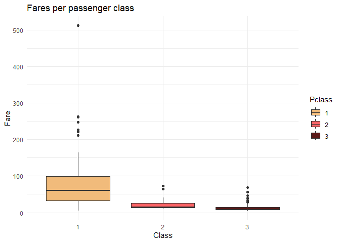

Titanic
================
Michal Rackiewicz
2023-09-29

### Load packages and data

``` r
library(tidyverse)
library(Hmisc)
library(corrplot)
library(ggpol)
library(gridExtra)
library(rlang)
library(wesanderson)
library(knitr)
```

``` r
options(digits = 2,
        warn = -1,
        scipen = 999)
```

``` r
train <- read_csv("./Data/train.csv", col_types = "nffcfnnncnf")
test <- read_csv("./Data/test.csv", col_types = "nffcfnnncnf")
```

## Exploratory data analysis

First we will look at the data structures and summary statistics for
each variable.

``` r
str(train)
```

    ## spc_tbl_ [891 × 12] (S3: spec_tbl_df/tbl_df/tbl/data.frame)
    ##  $ PassengerId: num [1:891] 1 2 3 4 5 6 7 8 9 10 ...
    ##  $ Survived   : Factor w/ 2 levels "0","1": 1 2 2 2 1 1 1 1 2 2 ...
    ##  $ Pclass     : Factor w/ 3 levels "3","1","2": 1 2 1 2 1 1 2 1 1 3 ...
    ##  $ Name       : chr [1:891] "Braund, Mr. Owen Harris" "Cumings, Mrs. John Bradley (Florence Briggs Thayer)" "Heikkinen, Miss. Laina" "Futrelle, Mrs. Jacques Heath (Lily May Peel)" ...
    ##  $ Sex        : Factor w/ 2 levels "male","female": 1 2 2 2 1 1 1 1 2 2 ...
    ##  $ Age        : num [1:891] 22 38 26 35 35 NA 54 2 27 14 ...
    ##  $ SibSp      : num [1:891] 1 1 0 1 0 0 0 3 0 1 ...
    ##  $ Parch      : num [1:891] 0 0 0 0 0 0 0 1 2 0 ...
    ##  $ Ticket     : chr [1:891] "A/5 21171" "PC 17599" "STON/O2. 3101282" "113803" ...
    ##  $ Fare       : num [1:891] 7.25 71.28 7.92 53.1 8.05 ...
    ##  $ Cabin      : Factor w/ 147 levels "C85","C123","E46",..: NA 1 NA 2 NA NA 3 NA NA NA ...
    ##  $ Embarked   : chr [1:891] "S" "C" "S" "S" ...
    ##  - attr(*, "spec")=
    ##   .. cols(
    ##   ..   PassengerId = col_number(),
    ##   ..   Survived = col_factor(levels = NULL, ordered = FALSE, include_na = FALSE),
    ##   ..   Pclass = col_factor(levels = NULL, ordered = FALSE, include_na = FALSE),
    ##   ..   Name = col_character(),
    ##   ..   Sex = col_factor(levels = NULL, ordered = FALSE, include_na = FALSE),
    ##   ..   Age = col_number(),
    ##   ..   SibSp = col_number(),
    ##   ..   Parch = col_number(),
    ##   ..   Ticket = col_character(),
    ##   ..   Fare = col_number(),
    ##   ..   Cabin = col_factor(levels = NULL, ordered = FALSE, include_na = FALSE),
    ##   ..   Embarked = col_character()
    ##   .. )
    ##  - attr(*, "problems")=<externalptr>

``` r
summary(train) %>% 
  kable()
```

|     | PassengerId | Survived | Pclass | Name             | Sex        | Age        | SibSp       | Parch       | Ticket           | Fare        | Cabin          | Embarked         |
|:----|:------------|:---------|:-------|:-----------------|:-----------|:-----------|:------------|:------------|:-----------------|:------------|:---------------|:-----------------|
|     | Min. : 1    | 0:549    | 3:491  | Length:891       | male :577  | Min. : 0   | Min. :0.0   | Min. :0.0   | Length:891       | Min. : 0    | G6 : 4         | Length:891       |
|     | 1st Qu.:224 | 1:342    | 1:216  | Class :character | female:314 | 1st Qu.:20 | 1st Qu.:0.0 | 1st Qu.:0.0 | Class :character | 1st Qu.: 8  | C23 C25 C27: 4 | Class :character |
|     | Median :446 | NA       | 2:184  | Mode :character  | NA         | Median :28 | Median :0.0 | Median :0.0 | Mode :character  | Median : 14 | B96 B98 : 4    | Mode :character  |
|     | Mean :446   | NA       | NA     | NA               | NA         | Mean :30   | Mean :0.5   | Mean :0.4   | NA               | Mean : 32   | F33 : 3        | NA               |
|     | 3rd Qu.:668 | NA       | NA     | NA               | NA         | 3rd Qu.:38 | 3rd Qu.:1.0 | 3rd Qu.:0.0 | NA               | 3rd Qu.: 31 | E101 : 3       | NA               |
|     | Max. :891   | NA       | NA     | NA               | NA         | Max. :80   | Max. :8.0   | Max. :6.0   | NA               | Max. :512   | (Other) :186   | NA               |
|     | NA          | NA       | NA     | NA               | NA         | NA’s :177  | NA          | NA          | NA               | NA          | NA’s :687      | NA               |

Let us also check the distribution of the dependent variable. By doing
this we get an idea of how balanced the data set is and whether we have
to do something to balance groups before modeling.

``` r
train %>% 
  select(Survived) %>% 
  group_by(Survived) %>% 
  summarise(Count = n()) %>% 
  mutate(Freq = paste0(round(100 * Count/sum(Count), 1), "%")) %>% 
  kable()
```

| Survived | Count | Freq  |
|:---------|------:|:------|
| 0        |   549 | 61.6% |
| 1        |   342 | 38.4% |

We also want to check for missing values.

``` r
train %>% 
  summarise_all(list(~sum(is.na(.)))) %>% 
  pivot_longer(cols = everything(), names_to = "Variable", values_to = "Missing")
```

    ## # A tibble: 12 × 2
    ##    Variable    Missing
    ##    <chr>         <int>
    ##  1 PassengerId       0
    ##  2 Survived          0
    ##  3 Pclass            0
    ##  4 Name              0
    ##  5 Sex               0
    ##  6 Age             177
    ##  7 SibSp             0
    ##  8 Parch             0
    ##  9 Ticket            0
    ## 10 Fare             15
    ## 11 Cabin           687
    ## 12 Embarked          2

We will impute missing values later on. For now, we want to proceed with
data visualization.

## Data visualization

We will divide the variables into numeric and categorical and visualize
each group.

``` r
numeric_vars <- train %>% 
  select(Age, Fare, SibSp, Parch, PassengerId) %>% 
  names()

categorical_vars <- train %>% 
  select(Survived, Pclass, Sex, Embarked) %>% 
  names()
```

#### Numeric variables

<!-- -->

Quick glance at the total numbers of passengers in each of the levels of
SibSp and Parch.

| SibSp | Count |
|------:|------:|
|     0 |   608 |
|     1 |   209 |
|     2 |    28 |
|     3 |    16 |
|     4 |    18 |
|     5 |     5 |
|     8 |     7 |

Numbers of passengers on board with their family

    ## # A tibble: 7 × 2
    ##   Parch Count
    ##   <int> <int>
    ## 1     0   678
    ## 2     1   118
    ## 3     2    80
    ## 4     3     5
    ## 5     4     4
    ## 6     5     5
    ## 7     6     1

#### Categorical variables

<!-- -->

First, we will plot a correlation map to get an idea of the
relationships between the variables.

<!-- --> PassengerID
shows no correlations with any other variable. It is evenly distributed
across passenger class and sex - the two strongest correlations with the
target variable.
<!-- -->

<!-- --> We will
remove it as it holds no predictive value.

``` r
train %>%
  group_by(Survived, Sex) %>% 
  summarise(n = n(), .groups = "drop") %>% 
  mutate(percentage = round(n*100/sum(n), 2),
         label = paste0(percentage,"%"),
         Survived = case_match(Survived,
                               "0" ~ "deceased",
                               "1" ~ "survived")) %>% 
  ggplot(aes(x = Sex,
             y = n,
             fill = Sex,
             label = label)) +
  geom_col() +
  facet_grid(~Survived) +
  labs(title = "Survival ratios for each sex",
       y = "Passenger count",
       x = "Sex",
       fill = "Sex") +
  theme_minimal()+
  scale_fill_manual(values = wes_palette("GrandBudapest1")) +
  theme(legend.position = "none")
```

<!-- -->

``` r
train %>% 
  group_by(Pclass, Survived) %>% 
  summarise(n = n(), .groupes = "drop") %>% 
  mutate(percentage = round(n*100/sum(n), 2), 
         label = paste0(percentage,"%"),
         Survived = case_match(Survived,
                              "0" ~ "deceased",
                              "1" ~ "survived")) %>% 
  ggplot(aes(x = Pclass,
             y = n,
             fill = Survived,
             label = label)) +
    geom_col() +
    labs(title = "Survival across classes",
         y = "Passenger count",
         x = "Passenger class",
         fill = "Survival status") +
  geom_label(position = position_stack(0.5),
             show.legend = FALSE) +
  theme_minimal() +
  scale_fill_manual(values = wes_palette("GrandBudapest1"))
```

    ## `summarise()` has grouped output by 'Pclass'. You can override using the
    ## `.groups` argument.

<!-- -->

It is not apparent from the correlation map that age has any influence
on survival. We do know however that children (and women) were more
likely to be saved. From this information we can already infer that the
relationship between survival and age is not linear as the likelihood of
survival does not increase with age. Let us take a closer look at the
distribution of survival rates across age for each sex.

<!-- -->

Let us look at the age distribution for both sexes in each passenger
class.

<!-- -->

<!-- -->

We can infer that females - in general - are more likely to survive. We
also see a large proportion of deceased female passengers in the 3rd
class, although absolute numbers are roughly equal between all three
classes.

Taken together this indicates that passenger class is a good predictor
of survival for females. For males the proportion of survivors is
smaller irrespective of class. Male passengers in first class were much
more likely to survive than in other classes.

Distribution of survivors based on the port of embarkation.

<!-- -->

It is apparent that the amount of survivors among the passengers
embarking in Cherbourg is relatively higher than in Queenstown or
Southhampton. From the correlation plot we know that this variable is
correlated with passenger class.

<!-- -->

We see that among the passengers embarking in Cherbourg, the majority
belonged to class 1, while the vast majority of passengers embarking in
Queensland (with the lowest proportion of survivors) belonged to the 3rd
class.

Fare SibSp

``` r
train %>% 
  pivot_longer(cols = Parch, names_to = "Variable", values_to = "Count") %>% 
  group_by(Variable, Count) %>% 
  summarise(n = n(), .groups = "drop") %>% 
  pivot_wider(names_from = c(Variable, Count), names_glue = "{Variable}_{Count}", values_from = "n")
```

    ## # A tibble: 1 × 7
    ##   Parch_0 Parch_1 Parch_2 Parch_3 Parch_4 Parch_5 Parch_6
    ##     <int>   <int>   <int>   <int>   <int>   <int>   <int>
    ## 1     678     118      80       5       4       5       1

``` r
options(tibble.print_max = 12, tibble.print_min = 4)

train %>% 
  mutate(Survived = case_match(Survived,
                              "0" ~ "deceased",
                              "1" ~ "survived")) %>% 
  group_by(Parch, Survived) %>% 
  filter(!is.na(Age)) %>% 
  summarise(Mean_age = round(mean(Age), 1),
            Median_age = median(Age),
            .groups = "drop") %>% 
  kable("simple", caption = "Meand and median age across levels of parents/children and survival status")
```

| Parch | Survived | Mean_age | Median_age |
|------:|:---------|---------:|-----------:|
|     0 | deceased |       32 |         29 |
|     0 | survived |       32 |         30 |
|     1 | deceased |       27 |         26 |
|     1 | survived |       23 |         22 |
|     2 | deceased |       17 |         11 |
|     2 | survived |       17 |         18 |
|     3 | deceased |       32 |         32 |
|     3 | survived |       34 |         24 |
|     4 | deceased |       44 |         42 |
|     5 | deceased |       40 |         39 |
|     5 | survived |       38 |         38 |
|     6 | deceased |       43 |         43 |

Meand and median age across levels of parents/children and survival
status

Passenger class and fare are both equally strong correlated with They
are, however, strongly negatively correlated with each other, i.e. the
highest fares are found in class 1.

<!-- -->

\`\`\` Since the passenger IDs are distributed uniformly across all
classes we will remove it as it holds no predictive value.

### Handling missing values

We will drop the following columns: PassengerId - no predictive value
Cabin - too many missing values

\`\`\`{r} train \<- train %\>% select(!Cabin)
