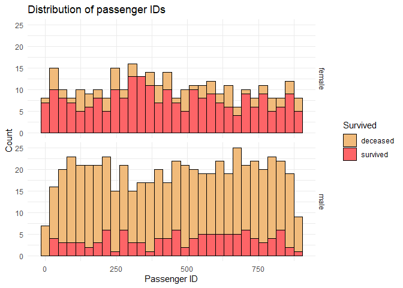
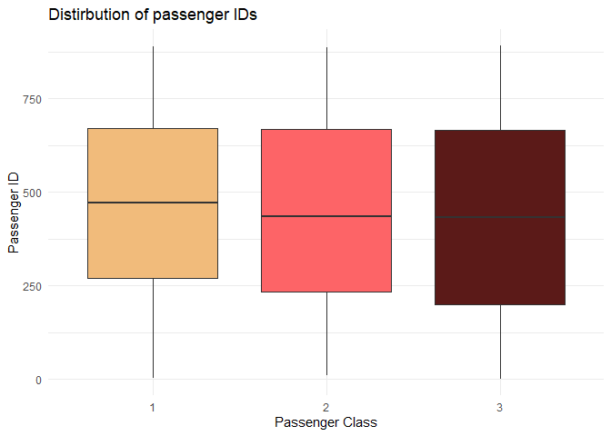

Titanic_readme
================
Michal Rackiewicz
2023-09-29

### Load packages and data

``` r
library(tidyverse)
library(Hmisc)
library(corrplot)
library(ggpol)
library(gridExtra)
library(rlang)
library(wesanderson)
```

``` r
options(digits = 2,
        warn = -1,
        scipen = 999)
```

``` r
train <- read_csv("./Data/train.csv", col_types = "nffcfnnncnf")
test <- read_csv("./Data/test.csv", col_types = "nffcfnnncnf")
```

## Exploratory data analysis

First we will look at the data structures and summary statistics for
each variable.

``` r
str(train)
```

    ## spc_tbl_ [891 × 12] (S3: spec_tbl_df/tbl_df/tbl/data.frame)
    ##  $ PassengerId: num [1:891] 1 2 3 4 5 6 7 8 9 10 ...
    ##  $ Survived   : Factor w/ 2 levels "0","1": 1 2 2 2 1 1 1 1 2 2 ...
    ##  $ Pclass     : Factor w/ 3 levels "3","1","2": 1 2 1 2 1 1 2 1 1 3 ...
    ##  $ Name       : chr [1:891] "Braund, Mr. Owen Harris" "Cumings, Mrs. John Bradley (Florence Briggs Thayer)" "Heikkinen, Miss. Laina" "Futrelle, Mrs. Jacques Heath (Lily May Peel)" ...
    ##  $ Sex        : Factor w/ 2 levels "male","female": 1 2 2 2 1 1 1 1 2 2 ...
    ##  $ Age        : num [1:891] 22 38 26 35 35 NA 54 2 27 14 ...
    ##  $ SibSp      : num [1:891] 1 1 0 1 0 0 0 3 0 1 ...
    ##  $ Parch      : num [1:891] 0 0 0 0 0 0 0 1 2 0 ...
    ##  $ Ticket     : chr [1:891] "A/5 21171" "PC 17599" "STON/O2. 3101282" "113803" ...
    ##  $ Fare       : num [1:891] 7.25 71.28 7.92 53.1 8.05 ...
    ##  $ Cabin      : Factor w/ 147 levels "C85","C123","E46",..: NA 1 NA 2 NA NA 3 NA NA NA ...
    ##  $ Embarked   : chr [1:891] "S" "C" "S" "S" ...
    ##  - attr(*, "spec")=
    ##   .. cols(
    ##   ..   PassengerId = col_number(),
    ##   ..   Survived = col_factor(levels = NULL, ordered = FALSE, include_na = FALSE),
    ##   ..   Pclass = col_factor(levels = NULL, ordered = FALSE, include_na = FALSE),
    ##   ..   Name = col_character(),
    ##   ..   Sex = col_factor(levels = NULL, ordered = FALSE, include_na = FALSE),
    ##   ..   Age = col_number(),
    ##   ..   SibSp = col_number(),
    ##   ..   Parch = col_number(),
    ##   ..   Ticket = col_character(),
    ##   ..   Fare = col_number(),
    ##   ..   Cabin = col_factor(levels = NULL, ordered = FALSE, include_na = FALSE),
    ##   ..   Embarked = col_character()
    ##   .. )
    ##  - attr(*, "problems")=<externalptr>

``` r
summary(train)
```

    ##   PassengerId  Survived Pclass      Name               Sex           Age     
    ##  Min.   :  1   0:549    3:491   Length:891         male  :577   Min.   : 0   
    ##  1st Qu.:224   1:342    1:216   Class :character   female:314   1st Qu.:20   
    ##  Median :446            2:184   Mode  :character                Median :28   
    ##  Mean   :446                                                    Mean   :30   
    ##  3rd Qu.:668                                                    3rd Qu.:38   
    ##  Max.   :891                                                    Max.   :80   
    ##                                                                 NA's   :177  
    ##      SibSp         Parch        Ticket               Fare             Cabin    
    ##  Min.   :0.0   Min.   :0.0   Length:891         Min.   :  0   G6         :  4  
    ##  1st Qu.:0.0   1st Qu.:0.0   Class :character   1st Qu.:  8   C23 C25 C27:  4  
    ##  Median :0.0   Median :0.0   Mode  :character   Median : 14   B96 B98    :  4  
    ##  Mean   :0.5   Mean   :0.4                      Mean   : 32   F33        :  3  
    ##  3rd Qu.:1.0   3rd Qu.:0.0                      3rd Qu.: 31   E101       :  3  
    ##  Max.   :8.0   Max.   :6.0                      Max.   :512   (Other)    :186  
    ##                                                               NA's       :687  
    ##    Embarked        
    ##  Length:891        
    ##  Class :character  
    ##  Mode  :character  
    ##                    
    ##                    
    ##                    
    ## 

Let us also check the distribution of the dependent variable. By doing
this we get an idea of how balanced the data set is and whether we have
to do something to balance groups before modeling.

``` r
train %>% 
  select(Survived) %>% 
  group_by(Survived) %>% 
  summarise(n = n()) %>% 
  mutate(Freq = paste0(round(100 * n/sum(n), 1), "%"))
```

    ## # A tibble: 2 × 3
    ##   Survived     n Freq 
    ##   <fct>    <int> <chr>
    ## 1 0          549 61.6%
    ## 2 1          342 38.4%

We also want to check for missing values.

``` r
train %>% 
  summarise_all(list(~sum(is.na(.)))) %>% 
  pivot_longer(cols = everything(), names_to = "Variable", values_to = "Missing")
```

    ## # A tibble: 12 × 2
    ##    Variable    Missing
    ##    <chr>         <int>
    ##  1 PassengerId       0
    ##  2 Survived          0
    ##  3 Pclass            0
    ##  4 Name              0
    ##  5 Sex               0
    ##  6 Age             177
    ##  7 SibSp             0
    ##  8 Parch             0
    ##  9 Ticket            0
    ## 10 Fare             15
    ## 11 Cabin           687
    ## 12 Embarked          2

We will impute missing values later on. For now, we want to proceed with
data visualization.

## Data visualization

We will divide the variables into numeric and categorical and visualize
each group.

``` r
numeric_vars <- train %>% 
  select(Age, Fare, SibSp, Parch, PassengerId) %>% 
  names()

categorical_vars <- train %>% 
  select(Survived, Pclass, Sex, Embarked) %>% 
  names()
```

#### Numeric variables

<!-- -->

Quick glance at the total numbers of passengers in each of the levels of
SibSp and Parch.

    ## # A tibble: 1 × 7
    ##   SibSp_0 SibSp_1 SibSp_2 SibSp_3 SibSp_4 SibSp_5 SibSp_8
    ##     <int>   <int>   <int>   <int>   <int>   <int>   <int>
    ## 1     608     209      28      16      18       5       7

    ## # A tibble: 1 × 7
    ##   Parch_0 Parch_1 Parch_2 Parch_3 Parch_4 Parch_5 Parch_6
    ##     <int>   <int>   <int>   <int>   <int>   <int>   <int>
    ## 1     678     118      80       5       4       5       1

#### Categorical variables

<!-- -->

First, we will plot a correlation map of numeric variables to get an
idea of the relationships between the variables.

<!-- -->

It is not apparent from the correlation map that age has any influence
on survival. We do know however that children (and women) were more
likely to be saved. From this information we can already infer that the
relationship between survival and age is not linear as the likelihood of
survival does not increase with age. Let us take a closer look at the
distribution of survival rates across age for each sex.

<!-- -->

Let us look at the age distribution for both sexes in each passenger
class.

<!-- -->

<!-- -->

We can infer that females - in general - are more likely to survive. We
also see a large proportion of deceased female passengers in the 3rd
class, although absolute numbers are roughly equal between all three
classes.

Taken together this indicates that passenger class is a good predictor
of survival for females. For males the proportion of survivors is
smaller irrespective of class. Male passengers in first class were much
more likely to survive than in other classes.

Passenger ID follows a uniform distribution and shows no correlation
with survival. We will first inspect whether it is independent of other
variables, which are correlated with survival, e.g. Sex and Embarked.

<!-- -->

<!-- -->

Passenger ID holds no predictive value it will thus be removed.

Distribution of survivors based on the port of embarkation.

    ## `summarise()` has grouped output by 'Embarked'. You can override using the
    ## `.groups` argument.

<!-- -->

It is apparent that the amount of survivors among the passengers
embarking in Cherbourg is relatively higher than in Queenstown or
Southhampton. From the correlation plot we know that this variable is
correlated with passenger class.

    ## `summarise()` has grouped output by 'Embarked'. You can override using the
    ## `.groups` argument.

<!-- -->

We see that among the passengers embarking in Cherbourg, the majority
belonged to class 1, while the vast majority of passengers embarking in
Queensland (with the lowest proportion of survivors) belonged to the 3rd
class.

``` r
train %>% 
  ggplot(aes(x = Parch, fill = Pclass)) +
  geom_bar(position = "dodge") +
  facet_grid(Sex ~ .) + 
  labs(title = "Numbers of passengers travelling with parents/children",
       y = "Count",
       x = "# of parents / children",
       fill = "Class") +
  theme_minimal() +
  scale_fill_manual(values = wes_palette("GrandBudapest1"))
```

<!-- -->

Passenger class and fare are both equally strong correlated with They
are, however, strongly negatively correlated with each other, i.e. the
highest fares are found in class 1.

<!-- -->

\`\`\` Since the passenger IDs are distributed uniformly across all
classes we will remove it as it holds no predictive value.

### Handling missing values

We will drop the following columns: PassengerId - no predictive value
Cabin - too many missing values

\`\`\`{r} train \<- train %\>% select(!Cabin)
