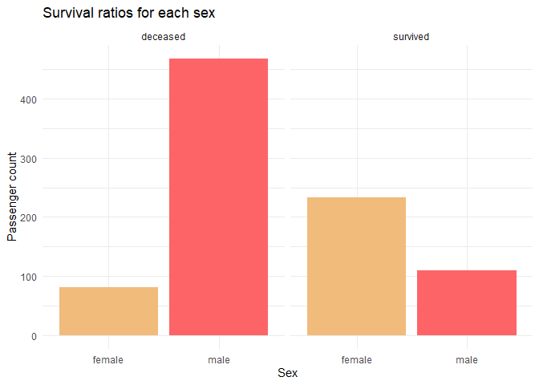
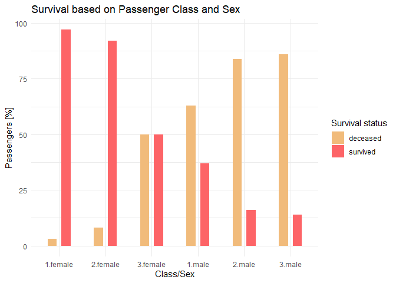
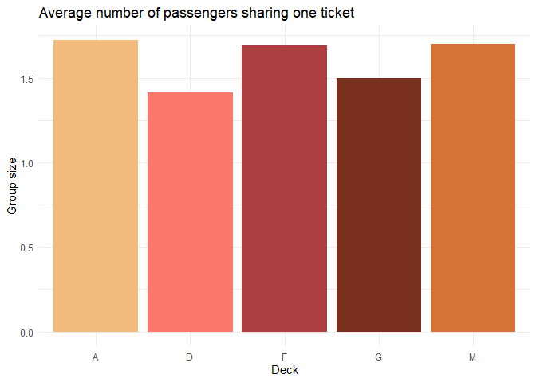

Titanic
================
Michal Rackiewicz
2023-09-29

### Load packages and data

``` r
# EDA
library(tidyverse)
library(Hmisc)
library(corrplot)
library(ggpol)
library(gridExtra)
library(rlang)
library(wesanderson)
library(knitr)

# Feature engineering
# library(fastDummies)

# Models
# library(caret)
```

Set seed for reproducibility

``` r
set.seed(1234)
```

``` r
options(digits = 2,
        warn = -1,
        scipen = 999)
```

``` r
train <- read_csv("./Data/train.csv", col_types = "nffcfnnncnf")
test <- read_csv("./Data/test.csv", col_types = "nffcfnnncnf")
```

## Exploratory data analysis

First we will look at the data structures and summary statistics for
each variable.

``` r
str(train)
```

    ## spc_tbl_ [891 × 12] (S3: spec_tbl_df/tbl_df/tbl/data.frame)
    ##  $ PassengerId: num [1:891] 1 2 3 4 5 6 7 8 9 10 ...
    ##  $ Survived   : Factor w/ 2 levels "0","1": 1 2 2 2 1 1 1 1 2 2 ...
    ##  $ Pclass     : Factor w/ 3 levels "3","1","2": 1 2 1 2 1 1 2 1 1 3 ...
    ##  $ Name       : chr [1:891] "Braund, Mr. Owen Harris" "Cumings, Mrs. John Bradley (Florence Briggs Thayer)" "Heikkinen, Miss. Laina" "Futrelle, Mrs. Jacques Heath (Lily May Peel)" ...
    ##  $ Sex        : Factor w/ 2 levels "male","female": 1 2 2 2 1 1 1 1 2 2 ...
    ##  $ Age        : num [1:891] 22 38 26 35 35 NA 54 2 27 14 ...
    ##  $ SibSp      : num [1:891] 1 1 0 1 0 0 0 3 0 1 ...
    ##  $ Parch      : num [1:891] 0 0 0 0 0 0 0 1 2 0 ...
    ##  $ Ticket     : chr [1:891] "A/5 21171" "PC 17599" "STON/O2. 3101282" "113803" ...
    ##  $ Fare       : num [1:891] 7.25 71.28 7.92 53.1 8.05 ...
    ##  $ Cabin      : Factor w/ 147 levels "C85","C123","E46",..: NA 1 NA 2 NA NA 3 NA NA NA ...
    ##  $ Embarked   : chr [1:891] "S" "C" "S" "S" ...
    ##  - attr(*, "spec")=
    ##   .. cols(
    ##   ..   PassengerId = col_number(),
    ##   ..   Survived = col_factor(levels = NULL, ordered = FALSE, include_na = FALSE),
    ##   ..   Pclass = col_factor(levels = NULL, ordered = FALSE, include_na = FALSE),
    ##   ..   Name = col_character(),
    ##   ..   Sex = col_factor(levels = NULL, ordered = FALSE, include_na = FALSE),
    ##   ..   Age = col_number(),
    ##   ..   SibSp = col_number(),
    ##   ..   Parch = col_number(),
    ##   ..   Ticket = col_character(),
    ##   ..   Fare = col_number(),
    ##   ..   Cabin = col_factor(levels = NULL, ordered = FALSE, include_na = FALSE),
    ##   ..   Embarked = col_character()
    ##   .. )
    ##  - attr(*, "problems")=<externalptr>

``` r
summary(train) %>% 
  kable()
```

|     | PassengerId | Survived | Pclass | Name             | Sex        | Age        | SibSp       | Parch       | Ticket           | Fare        | Cabin          | Embarked         |
|:----|:------------|:---------|:-------|:-----------------|:-----------|:-----------|:------------|:------------|:-----------------|:------------|:---------------|:-----------------|
|     | Min. : 1    | 0:549    | 3:491  | Length:891       | male :577  | Min. : 0   | Min. :0.0   | Min. :0.0   | Length:891       | Min. : 0    | G6 : 4         | Length:891       |
|     | 1st Qu.:224 | 1:342    | 1:216  | Class :character | female:314 | 1st Qu.:20 | 1st Qu.:0.0 | 1st Qu.:0.0 | Class :character | 1st Qu.: 8  | C23 C25 C27: 4 | Class :character |
|     | Median :446 | NA       | 2:184  | Mode :character  | NA         | Median :28 | Median :0.0 | Median :0.0 | Mode :character  | Median : 14 | B96 B98 : 4    | Mode :character  |
|     | Mean :446   | NA       | NA     | NA               | NA         | Mean :30   | Mean :0.5   | Mean :0.4   | NA               | Mean : 32   | F33 : 3        | NA               |
|     | 3rd Qu.:668 | NA       | NA     | NA               | NA         | 3rd Qu.:38 | 3rd Qu.:1.0 | 3rd Qu.:0.0 | NA               | 3rd Qu.: 31 | E101 : 3       | NA               |
|     | Max. :891   | NA       | NA     | NA               | NA         | Max. :80   | Max. :8.0   | Max. :6.0   | NA               | Max. :512   | (Other) :186   | NA               |
|     | NA          | NA       | NA     | NA               | NA         | NA’s :177  | NA          | NA          | NA               | NA          | NA’s :687      | NA               |

Let us also check the distribution of the dependent variable. By doing
this we get an idea of how balanced the data set is and whether we have
to do something to balance groups before modeling.

``` r
train %>% 
  select(Survived) %>% 
  group_by(Survived) %>% 
  summarise(Count = n()) %>% 
  mutate(Freq = paste0(round(100 * Count/sum(Count), 1), "%")) %>% 
  kable()
```

| Survived | Count | Freq  |
|:---------|------:|:------|
| 0        |   549 | 61.6% |
| 1        |   342 | 38.4% |

We also want to check for missing values.

``` r
train %>% 
  summarise_all(list( ~sum(is.na(.)))) %>% 
  pivot_longer(cols = everything(), 
               names_to = "Variable", 
               values_to = "Missing") %>% 
  arrange(desc(Missing)) %>% 
  mutate(n = 891,
         Proportion_missing = paste0(round(Missing*100/n, 1), "%")) %>% 
  select(!n) %>% 
  kable("simple")
```

| Variable    | Missing | Proportion_missing |
|:------------|--------:|:-------------------|
| Cabin       |     687 | 77.1%              |
| Age         |     177 | 19.9%              |
| Fare        |      15 | 1.7%               |
| Embarked    |       2 | 0.2%               |
| PassengerId |       0 | 0%                 |
| Survived    |       0 | 0%                 |
| Pclass      |       0 | 0%                 |
| Name        |       0 | 0%                 |
| Sex         |       0 | 0%                 |
| SibSp       |       0 | 0%                 |
| Parch       |       0 | 0%                 |
| Ticket      |       0 | 0%                 |

We will impute missing values later on. For now, we want to proceed with
data visualization.

## Data visualization

We will divide the variables into numeric and categorical and visualize
each group.

``` r
numeric_vars <- train %>% 
  select(Age, Fare, SibSp, Parch, PassengerId) %>% 
  names()

categorical_vars <- train %>% 
  select(Survived, Pclass, Sex, Embarked) %>% 
  names()
```

#### Numeric variables

<!-- -->

Quick glance at the total numbers of passengers travelling with their
families.

| SibSp | Count |
|------:|------:|
|     0 |   608 |
|     1 |   209 |
|     2 |    28 |
|     3 |    16 |
|     4 |    18 |
|     5 |     5 |
|     8 |     7 |

| Parch | Count |
|------:|------:|
|     0 |   678 |
|     1 |   118 |
|     2 |    80 |
|     3 |     5 |
|     4 |     4 |
|     5 |     5 |
|     6 |     1 |

#### Categorical variables

<!-- -->

First, we will plot a correlation map to get an idea of the
relationships between the variables.

<!-- -->

PassengerID shows no correlations with any other variable. It is evenly
distributed across passenger class and sex - the two strongest
correlations with the target variable.

<!-- -->

<!-- -->

We will remove it as it holds no predictive value.

<!-- -->

<!-- -->

It is not apparent from the correlation map that age has any influence
on survival. We do know however that children (and women) were more
likely to be saved. From this information we can already infer that the
relationship between survival and age is not linear as the likelihood of
survival does not increase with age. Let us take a closer look at the
distribution of survival rates across age for each sex.

<!-- -->

Let us look at the age distribution for both sexes in each passenger
class.

<!-- -->

<!-- -->

We can infer that females - in general - are more likely to survive. We
also see a large proportion of deceased female passengers in the 3rd
class, although absolute numbers are roughly equal between all three
classes.

Taken together this indicates that passenger class is a good predictor
of survival for females. For males the proportion of survivors is
smaller irrespective of class. Male passengers in first class were much
more likely to survive than in other classes.

Distribution of survivors based on the port of embarkation.

<!-- -->

It is apparent that the amount of survivors among the passengers
embarking in Cherbourg is relatively higher than in Queenstown or
Southhampton. From the correlation plot we know that this variable is
correlated with passenger class.

<!-- -->

We see that among the passengers embarking in Cherbourg, the majority
belonged to class 1, while the vast majority of passengers embarking in
Queensland (with the lowest proportion of survivors) belonged to the 3rd
class.

The ticket column contains numeric and mixed entries. We will
investigate whether there are any differences in the ticket types,
i.e. numeric vs. non-numeric, between different starting integers,
different strings of the non-numeric, etc. First we will separate
numeric and non-numeric types and group the ticket types based on
strings and first integers.

``` r
train <- train %>%
  # transform values to numeric. if not possible, it will default to NA
  mutate(Numeric_ticket = !is.na(as.numeric(Ticket)),
         # create categorical values based on evaluation of numeric_ticket.
         Ticket_group = case_when(
           #  extract string if non-numeric
         Numeric_ticket == FALSE~ str_extract(Ticket, "^[^\\s]+"),
         # extract first integer if numeric
         Numeric_ticket == TRUE ~ str_extract(Ticket, "^\\d")
         ),
         Ticket_group = gsub("\\.", "", Ticket_group)
         )
```

``` r
train %>% 
  count(Survived, Numeric_ticket, name = "Count") %>% 
  group_by(Numeric_ticket) %>% 
  mutate(Percentage = round(Count*100/sum(Count))) %>% 
  arrange(Numeric_ticket)
```

    ## # A tibble: 4 × 4
    ## # Groups:   Numeric_ticket [2]
    ##   Survived Numeric_ticket Count Percentage
    ##   <fct>    <lgl>          <int>      <dbl>
    ## 1 0        FALSE            142         62
    ## 2 1        FALSE             88         38
    ## 3 0        TRUE             407         62
    ## 4 1        TRUE             254         38

There is no difference in survival rate between numerical and
non-numerical tickets. We have also divided each class further.

``` r
options(tibble.print_max = 44, tibble.print_min = 4)

train %>% 
  count(Survived, Ticket_group, name = "Count") %>% 
  group_by(Ticket_group) %>% 
  mutate(Percentage = round(Count*100/sum(Count))) %>%
  # sort groups based on highest number of survivors
  arrange(desc(Count * (Survived == 1)), .by_group = TRUE) %>% 
  kable("simple")
```

| Survived | Ticket_group | Count | Percentage |
|:---------|:-------------|------:|-----------:|
| 1        | 1            |    92 |         63 |
| 0        | 1            |    54 |         37 |
| 1        | 2            |    85 |         46 |
| 0        | 2            |    98 |         54 |
| 1        | 3            |    72 |         24 |
| 0        | 3            |   229 |         76 |
| 1        | 4            |     2 |         20 |
| 0        | 4            |     8 |         80 |
| 0        | 5            |     3 |        100 |
| 1        | 6            |     1 |         17 |
| 0        | 6            |     5 |         83 |
| 1        | 7            |     1 |         11 |
| 0        | 7            |     8 |         89 |
| 0        | 8            |     2 |        100 |
| 1        | 9            |     1 |        100 |
| 0        | A/4          |     6 |        100 |
| 1        | A/5          |     2 |         11 |
| 0        | A/5          |    17 |         89 |
| 0        | A/S          |     1 |        100 |
| 0        | A4           |     1 |        100 |
| 0        | A5           |     2 |        100 |
| 1        | C            |     2 |         40 |
| 0        | C            |     3 |         60 |
| 1        | CA           |    14 |         34 |
| 0        | CA           |    27 |         66 |
| 0        | CA/SOTON     |     1 |        100 |
| 0        | FC           |     1 |        100 |
| 1        | FCC          |     4 |         80 |
| 0        | FCC          |     1 |         20 |
| 0        | Fa           |     1 |        100 |
| 1        | LINE         |     1 |         25 |
| 0        | LINE         |     3 |         75 |
| 1        | P/PP         |     1 |         50 |
| 0        | P/PP         |     1 |         50 |
| 1        | PC           |    39 |         65 |
| 0        | PC           |    21 |         35 |
| 1        | PP           |     2 |         67 |
| 0        | PP           |     1 |         33 |
| 1        | SC           |     1 |        100 |
| 0        | SC/A4        |     1 |        100 |
| 1        | SC/AH        |     2 |         67 |
| 0        | SC/AH        |     1 |         33 |
| 1        | SC/PARIS     |     3 |         43 |
| 0        | SC/PARIS     |     4 |         57 |
| 1        | SC/Paris     |     2 |         50 |
| 0        | SC/Paris     |     2 |         50 |
| 0        | SCO/W        |     1 |        100 |
| 1        | SO/C         |     1 |        100 |
| 0        | SO/PP        |     3 |        100 |
| 0        | SOC          |     5 |        100 |
| 0        | SOP          |     1 |        100 |
| 0        | SOTON/O2     |     2 |        100 |
| 1        | SOTON/OQ     |     2 |         13 |
| 0        | SOTON/OQ     |    13 |         87 |
| 0        | SP           |     1 |        100 |
| 1        | STON/O       |     5 |         42 |
| 0        | STON/O       |     7 |         58 |
| 1        | STON/O2      |     3 |         50 |
| 0        | STON/O2      |     3 |         50 |
| 1        | SW/PP        |     2 |        100 |
| 1        | W/C          |     1 |         10 |
| 0        | W/C          |     9 |         90 |
| 1        | WE/P         |     1 |         50 |
| 0        | WE/P         |     1 |         50 |
| 0        | WEP          |     1 |        100 |

There are too many groups to infer any meaningful pattern. Some groups
could probably be merged. SC/paris and SC/PARIS are an obvious choice
but others might be the result of ambiguous annotation.

### Imputation of missing values

Let’s take a quick look at the variables with missing values. But first
we will remove the Cabin and PassengerId columns.

``` r
train_cln <- train %>% select(!c(Cabin, PassengerId))
```

| Variable | Missing |
|:---------|--------:|
| Age      |     177 |
| Fare     |      15 |
| Embarked |       2 |

#### Embarked

For Embarked we will impute the mode. Since there is no mode function in
base R, we will create our own.

``` r
impute_mode <- function(df, var, na.rm = FALSE){
  var_mode <- names(which.max(table(df[[var]])))
  return(var_mode)
}
```

We can compare the missing values before and after imputation.

``` r
train_cln %>% 
  count(Embarked, name = "Count") %>% 
  kable("simple")
```

| Embarked | Count |
|:---------|------:|
| C        |   168 |
| Q        |    77 |
| S        |   644 |
| NA       |     2 |

``` r
train_cln %>% 
  mutate(Embarked = case_when(
    is.na(Embarked) ~ impute_mode(train_cln, "Embarked"),
    TRUE ~ as.character(Embarked)
  )) %>% 
  count(Embarked, name = "Count") %>% 
  kable("simple")
```

| Embarked | Count |
|:---------|------:|
| C        |   168 |
| Q        |    77 |
| S        |   646 |

``` r
train_imputed <- train_cln %>% 
  mutate(Embarked = case_when(
    is.na(Embarked) ~ impute_mode(train_cln, "Embarked"),
    TRUE ~ as.character(Embarked)
  ))
```

#### Fare

For the imputation of fare we can look again at the correlation matrix.
Passenger class and fare show the greatest correlation across all
variables.

<!-- -->

``` r
train_imputed %>% 
  group_by(Pclass) %>% 
  summarise(Count = n(),
            Mean_fare = round(mean(Fare, na.rm = TRUE), 1),
            Median_fare = median(Fare, na.rm = TRUE)) %>% 
  kable("simple")
```

| Pclass | Count | Mean_fare | Median_fare |
|:-------|------:|----------:|------------:|
| 1      |   216 |        86 |          61 |
| 2      |   184 |        21 |          15 |
| 3      |   491 |        13 |           8 |

From the differences between mean and median as well as the box plot
above we see few but significant outliers. Fare is also correlated with
passenger family size. Let us look at the fares across different family
sizes in each passenger class.

<!-- -->

``` r
train_imputed %>% 
  filter(!is.na(Fare)) %>% 
  ggplot(aes(x = factor(Parch),
             y = Fare,
             fill = factor(Parch))) +
  geom_boxplot() +
  labs(title = "Per class fares for passengers travelling with parents/children",
       y = "Fare",
       x = "Parents/Children") +
  facet_wrap(~Pclass) +
  theme_minimal() +
  theme(legend.position = "none") +
  scale_fill_manual(values = wes_palette("GrandBudapest1", 8, type = "continuous"))
```

<!-- -->

We see that fares increase with family size, independent of passenger
class. Since Parch and SibSp are correlated with each other we will
choose just one variable as we will remove multicorelated variables.

Let us look at how these variables are distributed among passengers
values.

``` r
train_imputed %>% 
  select(Fare, Pclass, SibSp, Parch) %>% 
  filter(is.na(Fare)) %>% 
  kable("simple")
```

|    Fare | Pclass    |    SibSp |                                                                                                                                      Parch |
|--------:|:----------|---------:|-------------------------------------------------------------------------------------------------------------------------------------------:|
|      NA | 3         |        0 |                                                                                                                                          0 |
|      NA | 1         |        0 |                                                                                                                                          0 |
|      NA | 3         |        0 |                                                                                                                                          0 |
|      NA | 2         |        0 |                                                                                                                                          0 |
|      NA | 3         |        0 |                                                                                                                                          0 |
|      NA | 2         |        0 |                                                                                                                                          0 |
|      NA | 2         |        0 |                                                                                                                                          0 |
|      NA | 2         |        0 |                                                                                                                                          0 |
|      NA | 3         |        0 |                                                                                                                                          0 |
|      NA | 1         |        0 |                                                                                                                                          0 |
|      NA | 2         |        0 |                                                                                                                                          0 |
|      NA | 2         |        0 |                                                                                                                                          0 |
|      NA | 1         |        0 |                                                                                                                                          0 |
|      NA | 1         |        0 |                                                                                                                                          0 |
|      NA | 1         |        0 |                                                                                                                                          0 |
| Althoug | h all pas |  sengers | with missing fares were travelling without family (Parch/SibSp = 0) we will choose one of these parameters to account for the unseen data. |
| We choo | se Parch  | here bec |                                                                           ause we will also use it for the imputation of the age variable. |

We can now examine some summary statistics to make a sound decision on
how we want to impute.

    ## # A tibble: 15 × 6
    ## # Groups:   Pclass [3]
    ##    Pclass Parch Fare_median Fare_mean    SD Count
    ##    <fct>  <int>       <dbl>     <dbl> <dbl> <int>
    ##  1 1          0        52       70.4  67.6    163
    ##  2 1          1        79      115.   95.1     31
    ##  3 1          2       120      150    76.0     21
    ##  4 1          4       263      263    NA        1
    ##  5 2          0        13       18.1  12.7    134
    ##  6 2          1        26       27.4   7.44    32
    ##  7 2          2        27       33.2  14.9     16
    ##  8 2          3        20.5     20.5   3.54     2
    ##  9 3          0         7        9.61  7.32   381
    ## 10 3          1        16       19.0   8.73    55
    ## 11 3          2        31       33.3  18.7     43
    ## 12 3          3        34       29     8.66     3
    ## 13 3          4        27       25     3.46     3
    ## 14 3          5        31       32.2   3.90     5
    ## 15 3          6        46       46    NA        1

Due to the large standard deviation in class 1 we choose the median for
imputation of fares.

Again we will create a function for the imputation.

``` r
impute_fare <- function(df, na.rm = FALSE){
  
  grouped_median_fares <- df %>% 
    group_by(Pclass, Parch) %>% 
    summarise(Fare_median = median(Fare, na.rm = TRUE))
  
  df <- df %>%
    left_join(grouped_median_fares, by = "Pclass") %>% 
    mutate(Fare = coalesce(Fare, Fare_median)) %>%
    select(-Fare_median)
    
  return(df)
}
```

Check missing values before and after imputation.

| Pclass | Missing_fare_values |
|:-------|--------------------:|
| 1      |                   5 |
| 2      |                   6 |
| 3      |                   4 |

``` r
train_imputed <- impute_fare(train_imputed)
```

    ## `summarise()` has grouped output by 'Pclass'. You can override using the
    ## `.groups` argument.

``` r
train_imputed %>% 
  group_by(Pclass) %>% 
  summarise(Missing_fare_values = sum(is.na(Fare))) %>% 
  kable("simple")
```

| Pclass | Missing_fare_values |
|:-------|--------------------:|
| 1      |                   0 |
| 2      |                   0 |
| 3      |                   0 |

#### Age imputation

For the imputation of age, we will extract the titles from inside the
name column. Then we will create title groups and calculate the mean and
standard deviation for each, from which we will sample and impute.

``` r
options(tibble.print_max = 17, tibble.print_min = 4)

train_imputed %>% 
    # Remove spaces
    mutate(Name = gsub(" ", "", Name),
           # Extract string following (including) comma
         Title = str_extract(Name, ",([a-zA-Z]*)"),
         # Remove comma
         Title = gsub(",", "", Title)) %>% 
  select(!Name) %>% 
  group_by(Title) %>% 
  count(Title, name = "Count", sort = TRUE) %>% 
  kable("simple")
```

| Title       | Count |
|:------------|------:|
| Mr          |  3025 |
| Miss        |  1034 |
| Mrs         |   626 |
| Master      |   244 |
| Dr          |    28 |
| Rev         |    24 |
| Col         |     8 |
| Major       |     8 |
| Mlle        |     8 |
| Capt        |     4 |
| Don         |     4 |
| Jonkheer    |     4 |
| Lady        |     4 |
| Mme         |     4 |
| Ms          |     4 |
| Sir         |     4 |
| theCountess |     4 |

We will create a small function for this operation.

``` r
extract_titles <- function(df, na.rm = FALSE){

  df <- df %>% 
      mutate(Name = gsub(" ", "", Name),
             Title = str_extract(Name, ",([a-zA-Z]*)"),
             Title = gsub(",", "", Title)) %>% 
    # remove name variable
      select(!Name)
  
  return(df)
}
```

``` r
train_with_titles <- extract_titles(train_imputed)
```

We want to have enough data in each group to perform robust imputation.
Therefore will will merge all titles into four groups: Mr, Miss, Mrs and
Master. We will merge “Lady”/“Countess”/“Ms” with “Mrs”, “Mme” with
“Miss”, and all other titles with “Mr”. Create another function called
“aggregate titles”.

``` r
aggregate_titles <- function(df, na.rm = FALSE){
  # create a negative selector helper function
  `%nin%` <- purrr::negate(`%in%`)
  
  df <- df %>% 
      mutate(
        # Aggregate female titles first
        Title = case_when(
          Title %in% c("Lady", "theCountess", "Ms") ~ "Mrs",
          Title == "Mme" ~ "Miss",
          TRUE ~ Title
          ),
        # Aggregate everything else
        Title = case_when(
          Title %nin% c("Mr", "Miss", "Mrs", "Master") ~ "Mr",
          TRUE ~ Title
          )
        )
  
  return(df)
}
```

``` r
train_with_titles <- aggregate_titles(train_with_titles)

train_with_titles %>% 
  group_by(Title) %>% 
  count(Title, name = "Count", sort = TRUE) %>% 
  kable("simple")
```

| Title  | Count |
|:-------|------:|
| Mr     |  3117 |
| Miss   |  1038 |
| Mrs    |   638 |
| Master |   244 |

| Title  |    n | mean | median |   sd |
|:-------|-----:|-----:|-------:|-----:|
| Master |  244 |  4.8 |      4 |  3.7 |
| Miss   | 1038 | 20.3 |     20 | 12.4 |
| Mr     | 3117 | 31.7 |     29 | 12.4 |
| Mrs    |  638 | 35.5 |     34 | 11.1 |

<!-- -->

<!-- -->

Since the title “Miss” is used for unmarried women, we will split the
“miss” group based on whether they were traveling with Parents and/or
children - assuming that those without are older.

``` r
train_with_titles %>% 
  filter(!is.na(Age)) %>%  # & Title == "Miss") %>% 
  mutate(Family = case_when(
    "Parch" == 0 ~ "No",
    TRUE ~ "Yes"
  )) %>% 
  ggplot(aes(x = Family,
             y = Age)) +
  geom_boxjitter(aes(fill = Family),
                 position = position_dodge(width = 0.5),
                 width = 0.4,
                 jitter.shape = 21,
                 jitter.color = NA,
                 outlier.shape = 1,
                 errorbar.draw = TRUE,
                 errorbar.length = 0.4) +
  labs(title = "Age distribution of male passengers in each class",
       y = "Age",
       x = "Traveling with family") +
  facet_grid(~Title) +
  theme_minimal() +
  theme(axis.text.x = element_blank()) +
  scale_fill_manual(values = wes_palette("GrandBudapest1"))
```

<!-- --> Our
assumption turns out to be true so we will consider it within our
imputation function. The same assumption seems to be true for young men
(“Master”) but with just one observation there is not enough data to
support it. Arguably one could also merge “Mr” and “Mrs” as their
distributions are very similar.

``` r
impute_age <- function(df){
  # set seed for reproducibility
  set.seed(1234)
  
  # helper function to calculate mean+sd
  group_mu_sd <- df %>% 
    mutate(Title = ifelse(Title == "Miss" & "Parch" > 0, "Miss_fam", Title)) %>% 
    group_by(Title) %>% 
    summarise(Mean = round(mean(Age, na.rm = TRUE)),
              SD = round(sd(Age, na.rm = TRUE)))
  
  # helper function for sampling from a normal distribution but within one standard deviation from the mean
  sample_rnorm_within_bounds <- function(mean, sd, lower = mean - sd, upper = mean + sd, max_attempts = 1000) {
    for (i in 1:max_attempts) {
      sample <- rnorm(1, mean, sd)
      if (sample >= lower && sample <= upper) {
        return(sample)
      }
    }
    stop(paste("Failed to sample a value within bounds after", max_attempts, "attempts."))
  }
  
  # impute age by random sampling from normal distribution
  df_age_imputed <- df %>%
    mutate(Title = ifelse(Title == "Miss" & "Parch" > 0, "Miss_fam", Title)) %>%
    left_join(group_mu_sd, by = "Title") %>% 
    group_by(Title) %>% 
    rowwise() %>% 
    mutate(Age = ifelse(
      is.na(Age),
      round(rnorm(1, mean = Mean, sd = SD)),
      Age
    )) %>% 
    select(-c(Mean, SD, Title))
  
  return(df_age_imputed)
}
```

Again we will compare the number of missing values before

| Title  | Missing |
|:-------|--------:|
| Master |      28 |
| Miss   |     243 |
| Mr     |     750 |
| Mrs    |      95 |

and after imputation

    ## Adding missing grouping variables: `Title`

| Title    | Missing |
|:---------|--------:|
| Master   |       0 |
| Miss_fam |       0 |
| Mr       |       0 |
| Mrs      |       0 |

Let us compare the mean and standard deviation of the original age
values

``` r
train_with_titles %>% 
  filter(!is.na(Age)) %>%
  mutate(Title = ifelse(Title == "Miss" & "Parch" > 0, "Miss_fam", Title)) %>% 
  group_by(Title) %>% 
    summarise(Count = n(),
      Mean = round(mean(Age, na.rm = TRUE), 1),
      SD   = round(sd(Age, na.rm = TRUE), 1)) %>% 
  kable("simple")
```

| Title    | Count | Mean |   SD |
|:---------|------:|-----:|-----:|
| Master   |   216 |  4.8 |  3.7 |
| Miss_fam |   795 | 20.3 | 12.4 |
| Mr       |  2367 | 31.7 | 12.4 |
| Mrs      |   543 | 35.5 | 11.1 |

with the imputed values

``` r
impute_age(train_with_titles) %>% 
  group_by(Title) %>% 
    summarise(Count = n(),
      Mean = round(mean(Age, na.rm = TRUE), 1),
      SD   = round(sd(Age, na.rm = TRUE), 1)) %>% 
  kable("simple")
```

    ## Adding missing grouping variables: `Title`

| Title    | Count | Mean |   SD |
|:---------|------:|-----:|-----:|
| Master   |   244 |  4.9 |  3.8 |
| Miss_fam |  1038 | 20.0 | 12.4 |
| Mr       |  3117 | 31.7 | 12.3 |
| Mrs      |   638 | 35.3 | 11.0 |

We can also compare the densities of Age before and after imputation.

``` r
train_with_titles %>% 
  filter(!is.na(Age)) %>% 
  ggplot() +
  geom_density(aes(x = Age))
```

<!-- -->

``` r
impute_age(train_with_titles) %>% 
  ggplot() +
  geom_density(aes(x = Age))
```

    ## Adding missing grouping variables: `Title`

<!-- -->

``` r
train_complete <- impute_age(train_with_titles)
```

    ## Adding missing grouping variables: `Title`

``` r
str(train_complete)
```

    ## rowws_df [5,037 × 13] (S3: rowwise_df/tbl_df/tbl/data.frame)
    ##  $ Title         : chr [1:5037] "Mr" "Mr" "Mr" "Mr" ...
    ##  $ Survived      : Factor w/ 2 levels "0","1": 1 1 1 1 1 1 1 2 2 2 ...
    ##  $ Pclass        : Factor w/ 3 levels "1","2","3": 3 3 3 3 3 3 3 1 1 1 ...
    ##  $ Sex           : Factor w/ 2 levels "female","male": 2 2 2 2 2 2 2 1 1 1 ...
    ##  $ Age           : num [1:5037] 22 22 22 22 22 22 22 38 38 38 ...
    ##  $ SibSp         : int [1:5037] 1 1 1 1 1 1 1 1 1 1 ...
    ##  $ Parch.x       : int [1:5037] 0 0 0 0 0 0 0 0 0 0 ...
    ##  $ Ticket        : chr [1:5037] "A/5 21171" "A/5 21171" "A/5 21171" "A/5 21171" ...
    ##  $ Fare          : num [1:5037] 7 7 7 7 7 7 7 71 71 71 ...
    ##  $ Embarked      : chr [1:5037] "S" "S" "S" "S" ...
    ##  $ Numeric_ticket: logi [1:5037] FALSE FALSE FALSE FALSE FALSE FALSE ...
    ##  $ Ticket_group  : chr [1:5037] "A/5" "A/5" "A/5" "A/5" ...
    ##  $ Parch.y       : int [1:5037] 0 1 2 3 4 5 6 0 1 2 ...
    ##  - attr(*, "groups")= tibble [5,037 × 2] (S3: tbl_df/tbl/data.frame)
    ##   ..$ Title: chr [1:5037] "Mr" "Mr" "Mr" "Mr" ...
    ##   ..$ .rows: list<int> [1:5037] 
    ##   .. ..$ : int 1
    ##   .. ..$ : int 2
    ##   .. ..$ : int 3
    ##   .. ..$ : int 4
    ##   .. ..$ : int 5
    ##   .. ..$ : int 6
    ##   .. ..$ : int 7
    ##   .. ..$ : int 8
    ##   .. ..$ : int 9
    ##   .. ..$ : int 10
    ##   .. ..$ : int 11
    ##   .. ..$ : int 12
    ##   .. ..$ : int 13
    ##   .. ..$ : int 14
    ##   .. ..$ : int 15
    ##   .. ..$ : int 16
    ##   .. ..$ : int 17
    ##   .. ..$ : int 18
    ##   .. ..$ : int 19
    ##   .. ..$ : int 20
    ##   .. ..$ : int 21
    ##   .. ..$ : int 22
    ##   .. ..$ : int 23
    ##   .. ..$ : int 24
    ##   .. ..$ : int 25
    ##   .. ..$ : int 26
    ##   .. ..$ : int 27
    ##   .. ..$ : int 28
    ##   .. ..$ : int 29
    ##   .. ..$ : int 30
    ##   .. ..$ : int 31
    ##   .. ..$ : int 32
    ##   .. ..$ : int 33
    ##   .. ..$ : int 34
    ##   .. ..$ : int 35
    ##   .. ..$ : int 36
    ##   .. ..$ : int 37
    ##   .. ..$ : int 38
    ##   .. ..$ : int 39
    ##   .. ..$ : int 40
    ##   .. ..$ : int 41
    ##   .. ..$ : int 42
    ##   .. ..$ : int 43
    ##   .. ..$ : int 44
    ##   .. ..$ : int 45
    ##   .. ..$ : int 46
    ##   .. ..$ : int 47
    ##   .. ..$ : int 48
    ##   .. ..$ : int 49
    ##   .. ..$ : int 50
    ##   .. ..$ : int 51
    ##   .. ..$ : int 52
    ##   .. ..$ : int 53
    ##   .. ..$ : int 54
    ##   .. ..$ : int 55
    ##   .. ..$ : int 56
    ##   .. ..$ : int 57
    ##   .. ..$ : int 58
    ##   .. ..$ : int 59
    ##   .. ..$ : int 60
    ##   .. ..$ : int 61
    ##   .. ..$ : int 62
    ##   .. ..$ : int 63
    ##   .. ..$ : int 64
    ##   .. ..$ : int 65
    ##   .. ..$ : int 66
    ##   .. ..$ : int 67
    ##   .. ..$ : int 68
    ##   .. ..$ : int 69
    ##   .. ..$ : int 70
    ##   .. ..$ : int 71
    ##   .. ..$ : int 72
    ##   .. ..$ : int 73
    ##   .. ..$ : int 74
    ##   .. ..$ : int 75
    ##   .. ..$ : int 76
    ##   .. ..$ : int 77
    ##   .. ..$ : int 78
    ##   .. ..$ : int 79
    ##   .. ..$ : int 80
    ##   .. ..$ : int 81
    ##   .. ..$ : int 82
    ##   .. ..$ : int 83
    ##   .. ..$ : int 84
    ##   .. ..$ : int 85
    ##   .. ..$ : int 86
    ##   .. ..$ : int 87
    ##   .. ..$ : int 88
    ##   .. ..$ : int 89
    ##   .. ..$ : int 90
    ##   .. ..$ : int 91
    ##   .. ..$ : int 92
    ##   .. ..$ : int 93
    ##   .. ..$ : int 94
    ##   .. ..$ : int 95
    ##   .. ..$ : int 96
    ##   .. ..$ : int 97
    ##   .. ..$ : int 98
    ##   .. ..$ : int 99
    ##   .. .. [list output truncated]
    ##   .. ..@ ptype: int(0)

### EDA summary

Quick review of the actions we have take after initial data
exploratio: - Imputed missing values in - Embarked: mode - Age: mean of
sex based on Parch - Fare: mean of passenger class based on Parch -
Removed unnecessary variables: - Name - Cabin - Passenger ID - Ticket

For ease of application we will implement all of the steps outlined
above into a handy function for data clean up and imputation.

``` r
clean_and_impute <- function(df, na.rm = FALSE){
  
  # Helper functions----
  # create a negative selector helper function
  `%nin%` <- purrr::negate(`%in%`)
  
  # helper function for sampling from a normal distribution but within one standard deviation from the mean
  sample_rnorm_within_bounds <- function(mean, sd, lower = mean - sd, upper = mean + sd, max_attempts = 1000) {
    for (i in 1:max_attempts) {
      sample <- rnorm(1, mean, sd)
      if (sample >= lower && sample <= upper) {
        return(sample)
      }
    }
    stop(paste("Failed to sample a value within bounds after", max_attempts, "attempts."))
  }
  
  # remove columns
  df_clean <- df %>% 
    select(-c(Cabin, PassengerId, Ticket))
  
  # Imputation----
  
  # Impute location of embarkation
  df_emb <- df_clean %>% 
    mutate(Embarked = case_when(
      is.na(Embarked) ~ impute_mode(train_cln, "Embarked"),
      TRUE ~ as.character(Embarked)
    ))
  
  # Impute_fare 
  grouped_median_fares <- df_emb %>% 
    group_by(Pclass, Parch) %>% 
    summarise(Fare_median = median(Fare, na.rm = TRUE))
  
  df_fare <- df_clean %>%
    left_join(grouped_median_fares, by = "Pclass") %>% 
    mutate(Fare = coalesce(Fare, Fare_median)) %>%
    select(-Fare_median)
  
  # Check for complete values
  ifelse(sum(is.na(df_fare$Fare)) == 0, 
         print("Fare successfully imputed!"), 
         print("Something went wrong!"))
  
  # Impute age 
  # Create title variable
  df_titles <- df_fare %>% 
    mutate(Name = gsub(" ", "", Name),
           Title = str_extract(Name, ",([a-zA-Z]*)"),
           Title = gsub(",", "", Title)) %>% 
  # remove name variable
    select(!Name) %>% 
    mutate(
      # Aggregate female titles first
      Title = case_when(
        Title %in% c("Lady", "theCountess", "Ms") ~ "Mrs",
        Title == "Mme" ~ "Miss",
        TRUE ~ Title
        ),
      # Aggregate everything else
      Title = case_when(
        Title %nin% c("Mr", "Miss", "Mrs", "Master") ~ "Mr",
        TRUE ~ Title
        )
      ) 

  # Helper function to calculate mean+sd of each title group
  group_mu_sd <- df_titles %>% 
    mutate(Title = ifelse(Title == "Miss" & Parch > 0, "Miss_fam", Title)) %>% 
    group_by(Title) %>% 
    summarise(Mean = round(mean(Age, na.rm = TRUE)),
              SD = round(sd(Age, na.rm = TRUE)))
  
  
  # impute age by random sampling from normal distribution
  df_imputed <- df_titles %>%
    mutate(Title = ifelse(Title == "Miss" & Parch > 0, "Miss_fam", Title)) %>%
    left_join(group_mu_sd, by = "Title") %>% 
    group_by(Title) %>% 
    rowwise() %>% 
    mutate(Age = ifelse(
      is.na(Age),
      round(rnorm(1, mean = Mean, sd = SD)),
      Age
    )) %>% 
    ungroup() %>% 
    select(-c(Mean, SD, Title))
  
  # Check for complete values
  ifelse(sum(is.na(df_imputed$Age)) == 0, 
         print("Fare successfully imputed!"), 
         print("Something went wrong!"))
  
  return(df_imputed)
  
}
```

## Feature engineering

First, we will separate our target variable from the predictor
variables.

``` r
train_y <- train_imputed$Survived
train_x <- train_imputed %>% select(-Survived)
```

In this section we will encode categorical variables and look for
correlated variables to remove. We will use the fastDummies package to
make quick work of encoding all character and factor columns. Also we
remove the first dummy column to avoid multicollinearity issues down the
line.

``` r
train_x_fe <- train_x %>% 
  mutate(SibSp = as.factor(SibSp),
         "Parch" = as.factor("Parch")) %>% 
  fastDummies::dummy_columns(remove_first_dummy = TRUE,
                             remove_selected_columns = TRUE)
```

``` r
str(train_x_fe)
```

    ## tibble [5,037 × 1,629] (S3: tbl_df/tbl/data.frame)
    ##  $ Age                                                                                    : int [1:5037] 22 22 22 22 22 22 22 38 38 38 ...
    ##  $ Parch.x                                                                                : int [1:5037] 0 0 0 0 0 0 0 0 0 0 ...
    ##  $ Fare                                                                                   : num [1:5037] 7 7 7 7 7 7 7 71 71 71 ...
    ##  $ Numeric_ticket                                                                         : logi [1:5037] FALSE FALSE FALSE FALSE FALSE FALSE ...
    ##  $ Parch.y                                                                                : int [1:5037] 0 1 2 3 4 5 6 0 1 2 ...
    ##  $ Pclass_2                                                                               : int [1:5037] 0 0 0 0 0 0 0 0 0 0 ...
    ##  $ Pclass_3                                                                               : int [1:5037] 1 1 1 1 1 1 1 0 0 0 ...
    ##  $ Name_Abbott, Mr. Rossmore Edward                                                       : int [1:5037] 0 0 0 0 0 0 0 0 0 0 ...
    ##  $ Name_Abbott, Mrs. Stanton (Rosa Hunt)                                                  : int [1:5037] 0 0 0 0 0 0 0 0 0 0 ...
    ##  $ Name_Abelson, Mr. Samuel                                                               : int [1:5037] 0 0 0 0 0 0 0 0 0 0 ...
    ##  $ Name_Abelson, Mrs. Samuel (Hannah Wizosky)                                             : int [1:5037] 0 0 0 0 0 0 0 0 0 0 ...
    ##  $ Name_Adahl, Mr. Mauritz Nils Martin                                                    : int [1:5037] 0 0 0 0 0 0 0 0 0 0 ...
    ##  $ Name_Adams, Mr. John                                                                   : int [1:5037] 0 0 0 0 0 0 0 0 0 0 ...
    ##  $ Name_Ahlin, Mrs. Johan (Johanna Persdotter Larsson)                                    : int [1:5037] 0 0 0 0 0 0 0 0 0 0 ...
    ##  $ Name_Aks, Mrs. Sam (Leah Rosen)                                                        : int [1:5037] 0 0 0 0 0 0 0 0 0 0 ...
    ##  $ Name_Albimona, Mr. Nassef Cassem                                                       : int [1:5037] 0 0 0 0 0 0 0 0 0 0 ...
    ##  $ Name_Alexander, Mr. William                                                            : int [1:5037] 0 0 0 0 0 0 0 0 0 0 ...
    ##  $ Name_Alhomaki, Mr. Ilmari Rudolf                                                       : int [1:5037] 0 0 0 0 0 0 0 0 0 0 ...
    ##  $ Name_Ali, Mr. Ahmed                                                                    : int [1:5037] 0 0 0 0 0 0 0 0 0 0 ...
    ##  $ Name_Ali, Mr. William                                                                  : int [1:5037] 0 0 0 0 0 0 0 0 0 0 ...
    ##  $ Name_Allen, Miss. Elisabeth Walton                                                     : int [1:5037] 0 0 0 0 0 0 0 0 0 0 ...
    ##  $ Name_Allen, Mr. William Henry                                                          : int [1:5037] 0 0 0 0 0 0 0 0 0 0 ...
    ##  $ Name_Allison, Master. Hudson Trevor                                                    : int [1:5037] 0 0 0 0 0 0 0 0 0 0 ...
    ##  $ Name_Allison, Miss. Helen Loraine                                                      : int [1:5037] 0 0 0 0 0 0 0 0 0 0 ...
    ##  $ Name_Allison, Mrs. Hudson J C (Bessie Waldo Daniels)                                   : int [1:5037] 0 0 0 0 0 0 0 0 0 0 ...
    ##  $ Name_Allum, Mr. Owen George                                                            : int [1:5037] 0 0 0 0 0 0 0 0 0 0 ...
    ##  $ Name_Andersen-Jensen, Miss. Carla Christine Nielsine                                   : int [1:5037] 0 0 0 0 0 0 0 0 0 0 ...
    ##  $ Name_Anderson, Mr. Harry                                                               : int [1:5037] 0 0 0 0 0 0 0 0 0 0 ...
    ##  $ Name_Andersson, Master. Sigvard Harald Elias                                           : int [1:5037] 0 0 0 0 0 0 0 0 0 0 ...
    ##  $ Name_Andersson, Miss. Ebba Iris Alfrida                                                : int [1:5037] 0 0 0 0 0 0 0 0 0 0 ...
    ##  $ Name_Andersson, Miss. Ellis Anna Maria                                                 : int [1:5037] 0 0 0 0 0 0 0 0 0 0 ...
    ##  $ Name_Andersson, Miss. Erna Alexandra                                                   : int [1:5037] 0 0 0 0 0 0 0 0 0 0 ...
    ##  $ Name_Andersson, Miss. Ingeborg Constanzia                                              : int [1:5037] 0 0 0 0 0 0 0 0 0 0 ...
    ##  $ Name_Andersson, Miss. Sigrid Elisabeth                                                 : int [1:5037] 0 0 0 0 0 0 0 0 0 0 ...
    ##  $ Name_Andersson, Mr. Anders Johan                                                       : int [1:5037] 0 0 0 0 0 0 0 0 0 0 ...
    ##  $ Name_Andersson, Mr. August Edvard ("Wennerstrom")                                      : int [1:5037] 0 0 0 0 0 0 0 0 0 0 ...
    ##  $ Name_Andersson, Mrs. Anders Johan (Alfrida Konstantia Brogren)                         : int [1:5037] 0 0 0 0 0 0 0 0 0 0 ...
    ##  $ Name_Andreasson, Mr. Paul Edvin                                                        : int [1:5037] 0 0 0 0 0 0 0 0 0 0 ...
    ##  $ Name_Andrew, Mr. Edgardo Samuel                                                        : int [1:5037] 0 0 0 0 0 0 0 0 0 0 ...
    ##  $ Name_Andrews, Miss. Kornelia Theodosia                                                 : int [1:5037] 0 0 0 0 0 0 0 0 0 0 ...
    ##  $ Name_Andrews, Mr. Thomas Jr                                                            : int [1:5037] 0 0 0 0 0 0 0 0 0 0 ...
    ##  $ Name_Angle, Mrs. William A (Florence "Mary" Agnes Hughes)                              : int [1:5037] 0 0 0 0 0 0 0 0 0 0 ...
    ##  $ Name_Appleton, Mrs. Edward Dale (Charlotte Lamson)                                     : int [1:5037] 0 0 0 0 0 0 0 0 0 0 ...
    ##  $ Name_Arnold-Franchi, Mr. Josef                                                         : int [1:5037] 0 0 0 0 0 0 0 0 0 0 ...
    ##  $ Name_Arnold-Franchi, Mrs. Josef (Josefine Franchi)                                     : int [1:5037] 0 0 0 0 0 0 0 0 0 0 ...
    ##  $ Name_Artagaveytia, Mr. Ramon                                                           : int [1:5037] 0 0 0 0 0 0 0 0 0 0 ...
    ##  $ Name_Asim, Mr. Adola                                                                   : int [1:5037] 0 0 0 0 0 0 0 0 0 0 ...
    ##  $ Name_Asplund, Master. Clarence Gustaf Hugo                                             : int [1:5037] 0 0 0 0 0 0 0 0 0 0 ...
    ##  $ Name_Asplund, Master. Edvin Rojj Felix                                                 : int [1:5037] 0 0 0 0 0 0 0 0 0 0 ...
    ##  $ Name_Asplund, Miss. Lillian Gertrud                                                    : int [1:5037] 0 0 0 0 0 0 0 0 0 0 ...
    ##  $ Name_Asplund, Mrs. Carl Oscar (Selma Augusta Emilia Johansson)                         : int [1:5037] 0 0 0 0 0 0 0 0 0 0 ...
    ##  $ Name_Astor, Mrs. John Jacob (Madeleine Talmadge Force)                                 : int [1:5037] 0 0 0 0 0 0 0 0 0 0 ...
    ##  $ Name_Attalah, Miss. Malake                                                             : int [1:5037] 0 0 0 0 0 0 0 0 0 0 ...
    ##  $ Name_Attalah, Mr. Sleiman                                                              : int [1:5037] 0 0 0 0 0 0 0 0 0 0 ...
    ##  $ Name_Aubart, Mme. Leontine Pauline                                                     : int [1:5037] 0 0 0 0 0 0 0 0 0 0 ...
    ##  $ Name_Augustsson, Mr. Albert                                                            : int [1:5037] 0 0 0 0 0 0 0 0 0 0 ...
    ##  $ Name_Ayoub, Miss. Banoura                                                              : int [1:5037] 0 0 0 0 0 0 0 0 0 0 ...
    ##  $ Name_Backstrom, Mr. Karl Alfred                                                        : int [1:5037] 0 0 0 0 0 0 0 0 0 0 ...
    ##  $ Name_Backstrom, Mrs. Karl Alfred (Maria Mathilda Gustafsson)                           : int [1:5037] 0 0 0 0 0 0 0 0 0 0 ...
    ##  $ Name_Baclini, Miss. Eugenie                                                            : int [1:5037] 0 0 0 0 0 0 0 0 0 0 ...
    ##  $ Name_Baclini, Miss. Helene Barbara                                                     : int [1:5037] 0 0 0 0 0 0 0 0 0 0 ...
    ##  $ Name_Baclini, Miss. Marie Catherine                                                    : int [1:5037] 0 0 0 0 0 0 0 0 0 0 ...
    ##  $ Name_Baclini, Mrs. Solomon (Latifa Qurban)                                             : int [1:5037] 0 0 0 0 0 0 0 0 0 0 ...
    ##  $ Name_Badt, Mr. Mohamed                                                                 : int [1:5037] 0 0 0 0 0 0 0 0 0 0 ...
    ##  $ Name_Bailey, Mr. Percy Andrew                                                          : int [1:5037] 0 0 0 0 0 0 0 0 0 0 ...
    ##  $ Name_Balkic, Mr. Cerin                                                                 : int [1:5037] 0 0 0 0 0 0 0 0 0 0 ...
    ##  $ Name_Ball, Mrs. (Ada E Hall)                                                           : int [1:5037] 0 0 0 0 0 0 0 0 0 0 ...
    ##  $ Name_Banfield, Mr. Frederick James                                                     : int [1:5037] 0 0 0 0 0 0 0 0 0 0 ...
    ##  $ Name_Barah, Mr. Hanna Assi                                                             : int [1:5037] 0 0 0 0 0 0 0 0 0 0 ...
    ##  $ Name_Barbara, Miss. Saiide                                                             : int [1:5037] 0 0 0 0 0 0 0 0 0 0 ...
    ##  $ Name_Barbara, Mrs. (Catherine David)                                                   : int [1:5037] 0 0 0 0 0 0 0 0 0 0 ...
    ##  $ Name_Barber, Miss. Ellen "Nellie"                                                      : int [1:5037] 0 0 0 0 0 0 0 0 0 0 ...
    ##  $ Name_Barkworth, Mr. Algernon Henry Wilson                                              : int [1:5037] 0 0 0 0 0 0 0 0 0 0 ...
    ##  $ Name_Barton, Mr. David John                                                            : int [1:5037] 0 0 0 0 0 0 0 0 0 0 ...
    ##  $ Name_Bateman, Rev. Robert James                                                        : int [1:5037] 0 0 0 0 0 0 0 0 0 0 ...
    ##  $ Name_Baumann, Mr. John D                                                               : int [1:5037] 0 0 0 0 0 0 0 0 0 0 ...
    ##  $ Name_Baxter, Mr. Quigg Edmond                                                          : int [1:5037] 0 0 0 0 0 0 0 0 0 0 ...
    ##  $ Name_Baxter, Mrs. James (Helene DeLaudeniere Chaput)                                   : int [1:5037] 0 0 0 0 0 0 0 0 0 0 ...
    ##  $ Name_Bazzani, Miss. Albina                                                             : int [1:5037] 0 0 0 0 0 0 0 0 0 0 ...
    ##  $ Name_Beane, Mr. Edward                                                                 : int [1:5037] 0 0 0 0 0 0 0 0 0 0 ...
    ##  $ Name_Beane, Mrs. Edward (Ethel Clarke)                                                 : int [1:5037] 0 0 0 0 0 0 0 0 0 0 ...
    ##  $ Name_Beavan, Mr. William Thomas                                                        : int [1:5037] 0 0 0 0 0 0 0 0 0 0 ...
    ##  $ Name_Becker, Master. Richard F                                                         : int [1:5037] 0 0 0 0 0 0 0 0 0 0 ...
    ##  $ Name_Becker, Miss. Marion Louise                                                       : int [1:5037] 0 0 0 0 0 0 0 0 0 0 ...
    ##  $ Name_Beckwith, Mr. Richard Leonard                                                     : int [1:5037] 0 0 0 0 0 0 0 0 0 0 ...
    ##  $ Name_Beckwith, Mrs. Richard Leonard (Sallie Monypeny)                                  : int [1:5037] 0 0 0 0 0 0 0 0 0 0 ...
    ##  $ Name_Beesley, Mr. Lawrence                                                             : int [1:5037] 0 0 0 0 0 0 0 0 0 0 ...
    ##  $ Name_Behr, Mr. Karl Howell                                                             : int [1:5037] 0 0 0 0 0 0 0 0 0 0 ...
    ##  $ Name_Bengtsson, Mr. John Viktor                                                        : int [1:5037] 0 0 0 0 0 0 0 0 0 0 ...
    ##  $ Name_Berglund, Mr. Karl Ivar Sven                                                      : int [1:5037] 0 0 0 0 0 0 0 0 0 0 ...
    ##  $ Name_Berriman, Mr. William John                                                        : int [1:5037] 0 0 0 0 0 0 0 0 0 0 ...
    ##  $ Name_Betros, Mr. Tannous                                                               : int [1:5037] 0 0 0 0 0 0 0 0 0 0 ...
    ##  $ Name_Bidois, Miss. Rosalie                                                             : int [1:5037] 0 0 0 0 0 0 0 0 0 0 ...
    ##  $ Name_Bing, Mr. Lee                                                                     : int [1:5037] 0 0 0 0 0 0 0 0 0 0 ...
    ##  $ Name_Birkeland, Mr. Hans Martin Monsen                                                 : int [1:5037] 0 0 0 0 0 0 0 0 0 0 ...
    ##  $ Name_Bishop, Mr. Dickinson H                                                           : int [1:5037] 0 0 0 0 0 0 0 0 0 0 ...
    ##  $ Name_Bishop, Mrs. Dickinson H (Helen Walton)                                           : int [1:5037] 0 0 0 0 0 0 0 0 0 0 ...
    ##  $ Name_Bissette, Miss. Amelia                                                            : int [1:5037] 0 0 0 0 0 0 0 0 0 0 ...
    ##  $ Name_Bjornstrom-Steffansson, Mr. Mauritz Hakan                                         : int [1:5037] 0 0 0 0 0 0 0 0 0 0 ...
    ##   [list output truncated]

In our approach we will compare tree-based models and logistic
regression. While the former are insensitive to distributions, logistic
regression might perform better when features are scaled uniformly.
There are still two numeric variables in the data: fare and age. Let us
again look at their distributions.

<!-- -->

The distribution of fare is right-skewed. We will transform it to log
scale.
