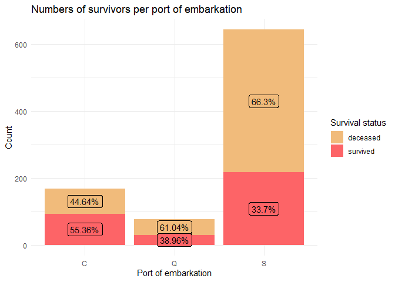

Titanic
================
Michal Rackiewicz
2023-09-29

### Load packages and data

``` r
library(tidyverse)
library(Hmisc)
library(corrplot)
library(ggpol)
library(gridExtra)
library(rlang)
library(wesanderson)
library(knitr)
```

``` r
options(digits = 2,
        warn = -1,
        scipen = 999)
```

``` r
train <- read_csv("./Data/train.csv", col_types = "nffcfnnncnf")
test <- read_csv("./Data/test.csv", col_types = "nffcfnnncnf")
```

## Exploratory data analysis

First we will look at the data structures and summary statistics for
each variable.

``` r
str(train)
```

    ## spc_tbl_ [891 × 12] (S3: spec_tbl_df/tbl_df/tbl/data.frame)
    ##  $ PassengerId: num [1:891] 1 2 3 4 5 6 7 8 9 10 ...
    ##  $ Survived   : Factor w/ 2 levels "0","1": 1 2 2 2 1 1 1 1 2 2 ...
    ##  $ Pclass     : Factor w/ 3 levels "3","1","2": 1 2 1 2 1 1 2 1 1 3 ...
    ##  $ Name       : chr [1:891] "Braund, Mr. Owen Harris" "Cumings, Mrs. John Bradley (Florence Briggs Thayer)" "Heikkinen, Miss. Laina" "Futrelle, Mrs. Jacques Heath (Lily May Peel)" ...
    ##  $ Sex        : Factor w/ 2 levels "male","female": 1 2 2 2 1 1 1 1 2 2 ...
    ##  $ Age        : num [1:891] 22 38 26 35 35 NA 54 2 27 14 ...
    ##  $ SibSp      : num [1:891] 1 1 0 1 0 0 0 3 0 1 ...
    ##  $ Parch      : num [1:891] 0 0 0 0 0 0 0 1 2 0 ...
    ##  $ Ticket     : chr [1:891] "A/5 21171" "PC 17599" "STON/O2. 3101282" "113803" ...
    ##  $ Fare       : num [1:891] 7.25 71.28 7.92 53.1 8.05 ...
    ##  $ Cabin      : Factor w/ 147 levels "C85","C123","E46",..: NA 1 NA 2 NA NA 3 NA NA NA ...
    ##  $ Embarked   : chr [1:891] "S" "C" "S" "S" ...
    ##  - attr(*, "spec")=
    ##   .. cols(
    ##   ..   PassengerId = col_number(),
    ##   ..   Survived = col_factor(levels = NULL, ordered = FALSE, include_na = FALSE),
    ##   ..   Pclass = col_factor(levels = NULL, ordered = FALSE, include_na = FALSE),
    ##   ..   Name = col_character(),
    ##   ..   Sex = col_factor(levels = NULL, ordered = FALSE, include_na = FALSE),
    ##   ..   Age = col_number(),
    ##   ..   SibSp = col_number(),
    ##   ..   Parch = col_number(),
    ##   ..   Ticket = col_character(),
    ##   ..   Fare = col_number(),
    ##   ..   Cabin = col_factor(levels = NULL, ordered = FALSE, include_na = FALSE),
    ##   ..   Embarked = col_character()
    ##   .. )
    ##  - attr(*, "problems")=<externalptr>

``` r
summary(train) %>% 
  kable()
```

|     | PassengerId | Survived | Pclass | Name             | Sex        | Age        | SibSp       | Parch       | Ticket           | Fare        | Cabin          | Embarked         |
|:----|:------------|:---------|:-------|:-----------------|:-----------|:-----------|:------------|:------------|:-----------------|:------------|:---------------|:-----------------|
|     | Min. : 1    | 0:549    | 3:491  | Length:891       | male :577  | Min. : 0   | Min. :0.0   | Min. :0.0   | Length:891       | Min. : 0    | G6 : 4         | Length:891       |
|     | 1st Qu.:224 | 1:342    | 1:216  | Class :character | female:314 | 1st Qu.:20 | 1st Qu.:0.0 | 1st Qu.:0.0 | Class :character | 1st Qu.: 8  | C23 C25 C27: 4 | Class :character |
|     | Median :446 | NA       | 2:184  | Mode :character  | NA         | Median :28 | Median :0.0 | Median :0.0 | Mode :character  | Median : 14 | B96 B98 : 4    | Mode :character  |
|     | Mean :446   | NA       | NA     | NA               | NA         | Mean :30   | Mean :0.5   | Mean :0.4   | NA               | Mean : 32   | F33 : 3        | NA               |
|     | 3rd Qu.:668 | NA       | NA     | NA               | NA         | 3rd Qu.:38 | 3rd Qu.:1.0 | 3rd Qu.:0.0 | NA               | 3rd Qu.: 31 | E101 : 3       | NA               |
|     | Max. :891   | NA       | NA     | NA               | NA         | Max. :80   | Max. :8.0   | Max. :6.0   | NA               | Max. :512   | (Other) :186   | NA               |
|     | NA          | NA       | NA     | NA               | NA         | NA’s :177  | NA          | NA          | NA               | NA          | NA’s :687      | NA               |

Let us also check the distribution of the dependent variable. By doing
this we get an idea of how balanced the data set is and whether we have
to do something to balance groups before modeling.

``` r
train %>% 
  select(Survived) %>% 
  group_by(Survived) %>% 
  summarise(Count = n()) %>% 
  mutate(Freq = paste0(round(100 * Count/sum(Count), 1), "%")) %>% 
  kable()
```

| Survived | Count | Freq  |
|:---------|------:|:------|
| 0        |   549 | 61.6% |
| 1        |   342 | 38.4% |

We also want to check for missing values.

``` r
train %>% 
  summarise_all(list( ~sum(is.na(.)))) %>% 
  pivot_longer(cols = everything(), 
               names_to = "Variable", 
               values_to = "Missing") %>% 
  arrange(desc(Missing)) %>% 
  mutate(n = 891,
         Proportion_missing = paste0(round(Missing*100/n, 1), "%")) %>% 
  select(!n) %>% 
  kable("simple")
```

| Variable    | Missing | Proportion_missing |
|:------------|--------:|:-------------------|
| Cabin       |     687 | 77.1%              |
| Age         |     177 | 19.9%              |
| Fare        |      15 | 1.7%               |
| Embarked    |       2 | 0.2%               |
| PassengerId |       0 | 0%                 |
| Survived    |       0 | 0%                 |
| Pclass      |       0 | 0%                 |
| Name        |       0 | 0%                 |
| Sex         |       0 | 0%                 |
| SibSp       |       0 | 0%                 |
| Parch       |       0 | 0%                 |
| Ticket      |       0 | 0%                 |

We will impute missing values later on. For now, we want to proceed with
data visualization.

## Data visualization

We will divide the variables into numeric and categorical and visualize
each group.

``` r
numeric_vars <- train %>% 
  select(Age, Fare, SibSp, Parch, PassengerId) %>% 
  names()

categorical_vars <- train %>% 
  select(Survived, Pclass, Sex, Embarked) %>% 
  names()
```

#### Numeric variables

<!-- -->

Quick glance at the total numbers of passengers travelling with their
families.

| SibSp | Count |
|------:|------:|
|     0 |   608 |
|     1 |   209 |
|     2 |    28 |
|     3 |    16 |
|     4 |    18 |
|     5 |     5 |
|     8 |     7 |

| Parch | Count |
|------:|------:|
|     0 |   678 |
|     1 |   118 |
|     2 |    80 |
|     3 |     5 |
|     4 |     4 |
|     5 |     5 |
|     6 |     1 |

#### Categorical variables

<!-- -->

First, we will plot a correlation map to get an idea of the
relationships between the variables.

<!-- -->

PassengerID shows no correlations with any other variable. It is evenly
distributed across passenger class and sex - the two strongest
correlations with the target variable.

<!-- -->

<!-- -->

We will remove it as it holds no predictive value.

<!-- -->

<!-- -->

It is not apparent from the correlation map that age has any influence
on survival. We do know however that children (and women) were more
likely to be saved. From this information we can already infer that the
relationship between survival and age is not linear as the likelihood of
survival does not increase with age. Let us take a closer look at the
distribution of survival rates across age for each sex.

<!-- -->

Let us look at the age distribution for both sexes in each passenger
class.

<!-- -->

<!-- -->

We can infer that females - in general - are more likely to survive. We
also see a large proportion of deceased female passengers in the 3rd
class, although absolute numbers are roughly equal between all three
classes.

Taken together this indicates that passenger class is a good predictor
of survival for females. For males the proportion of survivors is
smaller irrespective of class. Male passengers in first class were much
more likely to survive than in other classes.

Distribution of survivors based on the port of embarkation.

<!-- -->

It is apparent that the amount of survivors among the passengers
embarking in Cherbourg is relatively higher than in Queenstown or
Southhampton. From the correlation plot we know that this variable is
correlated with passenger class.

<!-- -->

We see that among the passengers embarking in Cherbourg, the majority
belonged to class 1, while the vast majority of passengers embarking in
Queensland (with the lowest proportion of survivors) belonged to the 3rd
class.

The ticket column contains numeric and mixed entries. We will
investigate whether there are any differences in the ticket types,
i.e. numeric vs. non-numeric, between different starting integers,
different strings of the non-numeric, etc. First we will separate
numeric and non-numeric types and group the ticket types based on
strings and first integers.

``` r
train <- train %>%
  # transform values to numeric. if not possible, it will default to NA
  mutate(Numeric_ticket = !is.na(as.numeric(Ticket)),
         # create categorical values based on evaluation of numeric_ticket.
         Ticket_group = case_when(
           #  extract string if non-numeric
         Numeric_ticket == FALSE~ str_extract(Ticket, "^[^\\s]+"),
         # extract first integer if numeric
         Numeric_ticket == TRUE ~ str_extract(Ticket, "^\\d")
         ),
         Ticket_group = gsub("\\.", "", Ticket_group)
         )
```

``` r
train %>% 
  count(Survived, Numeric_ticket, name = "Count") %>% 
  group_by(Numeric_ticket) %>% 
  mutate(Percentage = round(Count*100/sum(Count))) %>% 
  arrange(Numeric_ticket)
```

    ## # A tibble: 4 × 4
    ## # Groups:   Numeric_ticket [2]
    ##   Survived Numeric_ticket Count Percentage
    ##   <fct>    <lgl>          <int>      <dbl>
    ## 1 0        FALSE            142         62
    ## 2 1        FALSE             88         38
    ## 3 0        TRUE             407         62
    ## 4 1        TRUE             254         38

There is no difference in survival rate between numerical and
non-numerical tickets. We have also divided each class further.

``` r
options(tibble.print_max = 44, tibble.print_min = 4)

train %>% 
  count(Survived, Ticket_group, name = "Count") %>% 
  group_by(Ticket_group) %>% 
  mutate(Percentage = round(Count*100/sum(Count))) %>%
  # sort groups based on highest number of survivors
  arrange(desc(Count * (Survived == 1)), .by_group = TRUE) %>% 
  kable("simple")
```

| Survived | Ticket_group | Count | Percentage |
|:---------|:-------------|------:|-----------:|
| 1        | 1            |    92 |         63 |
| 0        | 1            |    54 |         37 |
| 1        | 2            |    85 |         46 |
| 0        | 2            |    98 |         54 |
| 1        | 3            |    72 |         24 |
| 0        | 3            |   229 |         76 |
| 1        | 4            |     2 |         20 |
| 0        | 4            |     8 |         80 |
| 0        | 5            |     3 |        100 |
| 1        | 6            |     1 |         17 |
| 0        | 6            |     5 |         83 |
| 1        | 7            |     1 |         11 |
| 0        | 7            |     8 |         89 |
| 0        | 8            |     2 |        100 |
| 1        | 9            |     1 |        100 |
| 0        | A/4          |     6 |        100 |
| 1        | A/5          |     2 |         11 |
| 0        | A/5          |    17 |         89 |
| 0        | A/S          |     1 |        100 |
| 0        | A4           |     1 |        100 |
| 0        | A5           |     2 |        100 |
| 1        | C            |     2 |         40 |
| 0        | C            |     3 |         60 |
| 1        | CA           |    14 |         34 |
| 0        | CA           |    27 |         66 |
| 0        | CA/SOTON     |     1 |        100 |
| 0        | FC           |     1 |        100 |
| 1        | FCC          |     4 |         80 |
| 0        | FCC          |     1 |         20 |
| 0        | Fa           |     1 |        100 |
| 1        | LINE         |     1 |         25 |
| 0        | LINE         |     3 |         75 |
| 1        | P/PP         |     1 |         50 |
| 0        | P/PP         |     1 |         50 |
| 1        | PC           |    39 |         65 |
| 0        | PC           |    21 |         35 |
| 1        | PP           |     2 |         67 |
| 0        | PP           |     1 |         33 |
| 1        | SC           |     1 |        100 |
| 0        | SC/A4        |     1 |        100 |
| 1        | SC/AH        |     2 |         67 |
| 0        | SC/AH        |     1 |         33 |
| 1        | SC/PARIS     |     3 |         43 |
| 0        | SC/PARIS     |     4 |         57 |
| 1        | SC/Paris     |     2 |         50 |
| 0        | SC/Paris     |     2 |         50 |
| 0        | SCO/W        |     1 |        100 |
| 1        | SO/C         |     1 |        100 |
| 0        | SO/PP        |     3 |        100 |
| 0        | SOC          |     5 |        100 |
| 0        | SOP          |     1 |        100 |
| 0        | SOTON/O2     |     2 |        100 |
| 1        | SOTON/OQ     |     2 |         13 |
| 0        | SOTON/OQ     |    13 |         87 |
| 0        | SP           |     1 |        100 |
| 1        | STON/O       |     5 |         42 |
| 0        | STON/O       |     7 |         58 |
| 1        | STON/O2      |     3 |         50 |
| 0        | STON/O2      |     3 |         50 |
| 1        | SW/PP        |     2 |        100 |
| 1        | W/C          |     1 |         10 |
| 0        | W/C          |     9 |         90 |
| 1        | WE/P         |     1 |         50 |
| 0        | WE/P         |     1 |         50 |
| 0        | WEP          |     1 |        100 |

There are too many groups to infer any meaningful pattern. Some groups
could probably be merged. SC/paris and SC/PARIS are an obvious choice
but others might be the result of ambiguous annotation.

### Imputation of missing values

Let’s take a quick look at the variables with missing values. But first
we will remove the Cabin and PassengerId columns.

``` r
train_cln <- train %>% select(!c(Cabin, PassengerId))
```

| Variable | Missing |
|:---------|--------:|
| Age      |     177 |
| Fare     |      15 |
| Embarked |       2 |

#### Embarked

For Embarked we will impute the mode. Since there is no mode function in
base R, we will create our own.

``` r
impute_mode <- function(df, var, na.rm = FALSE){
  var_mode <- names(which.max(table(df[[var]])))
  return(var_mode)
}
```

We can compare the missing values before and after imputation.

``` r
train_cln %>% 
  count(Embarked, name = "Count") %>% 
  kable("simple")
```

| Embarked | Count |
|:---------|------:|
| C        |   168 |
| Q        |    77 |
| S        |   644 |
| NA       |     2 |

``` r
train_cln %>% 
  mutate(Embarked = case_when(
    is.na(Embarked) ~ impute_mode(train_cln, "Embarked"),
    TRUE ~ as.character(Embarked)
  )) %>% 
  count(Embarked, name = "Count") %>% 
  kable("simple")
```

| Embarked | Count |
|:---------|------:|
| C        |   168 |
| Q        |    77 |
| S        |   646 |

``` r
train_imputed <- train_cln %>% 
  mutate(Embarked = case_when(
    is.na(Embarked) ~ impute_mode(train_cln, "Embarked"),
    TRUE ~ as.character(Embarked)
  ))
```

#### Fare

For the imputation of fare we can look again at the correlation matrix.
Passenger class and fare show the greatest correlation across all
variables, followed by Parch/SibSp.

<!-- -->

``` r
train_imputed %>% 
  group_by(Pclass) %>% 
  summarise(Count = n(),
            Mean_fare = round(mean(Fare, na.rm = TRUE), 1),
            Median_fare = median(Fare, na.rm = TRUE)) %>% 
  kable("simple")
```

| Pclass | Count | Mean_fare | Median_fare |
|:-------|------:|----------:|------------:|
| 1      |   216 |        86 |          61 |
| 2      |   184 |        21 |          15 |
| 3      |   491 |        13 |           8 |

From the differences between mean and median as well as the box plot
above we see few, but significant outliers. Therefore we will use the
median.

<!-- -->

Let us look at these variables for the missing Fare values.

``` r
train_imputed %>% 
  select(Fare, Pclass, SibSp, Parch) %>% 
  filter(is.na(Fare)) %>% 
  kable("simple")
```

| Fare | Pclass | SibSp | Parch |
|-----:|:-------|------:|------:|
|   NA | 3      |     0 |     0 |
|   NA | 1      |     0 |     0 |
|   NA | 3      |     0 |     0 |
|   NA | 2      |     0 |     0 |
|   NA | 3      |     0 |     0 |
|   NA | 2      |     0 |     0 |
|   NA | 2      |     0 |     0 |
|   NA | 2      |     0 |     0 |
|   NA | 3      |     0 |     0 |
|   NA | 1      |     0 |     0 |
|   NA | 2      |     0 |     0 |
|   NA | 2      |     0 |     0 |
|   NA | 1      |     0 |     0 |
|   NA | 1      |     0 |     0 |
|   NA | 1      |     0 |     0 |

Since the only level for SibSp and Parch is 0, we will impute fare based
on the passenger class.

Again we will create a function for the imputation.

``` r
impute_fare <- function(df, na.rm = FALSE){
  grouped_median_fares <- df %>% 
    group_by(Pclass) %>% 
    summarise(Fare_median = median(Fare, na.rm = TRUE))
  
  df <- df %>%
    left_join(grouped_median_fares, by = "Pclass") %>% 
    mutate(Fare = coalesce(Fare, Fare_median)) %>%
    select(-Fare_median)
    
  return(df)
}
```

Check missing values before and after imputation.

| Pclass | Missing_fare_values |
|:-------|--------------------:|
| 1      |                   5 |
| 2      |                   6 |
| 3      |                   4 |

``` r
train_imputed <- impute_fare(train_imputed)
```

``` r
train_imputed %>% 
  group_by(Pclass) %>% 
  summarise(Missing_fare_values = sum(is.na(Fare))) %>% 
  kable("simple")
```

| Pclass | Missing_fare_values |
|:-------|--------------------:|
| 1      |                   0 |
| 2      |                   0 |
| 3      |                   0 |

#### Age imputation

For the imputation of age, we will extract the titles from inside the
name column. Then we will create title groups and calculate the mean and
standard deviation for each, from which we will sample and impute.

``` r
options(tibble.print_max = 17, tibble.print_min = 4)

train_imputed %>% 
    # Remove spaces
    mutate(Name = gsub(" ", "", Name),
           # Extract string following (including) comma
         Title = str_extract(Name, ",([a-zA-Z]*)"),
         # Remove comma
         Title = gsub(",", "", Title)) %>% 
  select(!Name) %>% 
  group_by(Title) %>% 
  count(Title, name = "Count", sort = TRUE) %>% 
  kable("simple")
```

| Title       | Count |
|:------------|------:|
| Mr          |   517 |
| Miss        |   182 |
| Mrs         |   125 |
| Master      |    40 |
| Dr          |     7 |
| Rev         |     6 |
| Col         |     2 |
| Major       |     2 |
| Mlle        |     2 |
| Capt        |     1 |
| Don         |     1 |
| Jonkheer    |     1 |
| Lady        |     1 |
| Mme         |     1 |
| Ms          |     1 |
| Sir         |     1 |
| theCountess |     1 |

We will create a small function for this operation.

``` r
extract_titles <- function(df, na.rm = FALSE){

  df <- df %>% 
      mutate(Name = gsub(" ", "", Name),
             Title = str_extract(Name, ",([a-zA-Z]*)"),
             Title = gsub(",", "", Title)) %>% 
      select(!Name)
  
  return(df)
}
```

``` r
train_with_titles <- extract_titles(train_imputed)
```

We want to have enough data in each group to perform robust imputation.
Therefore will will merge all titles into four groups: Mr, Miss, Mrs and
Master. We will merge “Lady”/“Countess”/“Ms” with “Mrs”, “Mme” with
“Miss”, and all other titles with “Mr”. Create another function called
“aggregate titles”.

``` r
aggregate_titles <- function(df, na.rm = FALSE){
  # create a negative selector helper function
  `%nin%` <- purrr::negate(`%in%`)
  
  df <- df %>% 
      mutate(
        # Aggregate female titles first
        Title = case_when(
          Title %in% c("Lady", "theCountess", "Ms") ~ "Mrs",
          Title == "Mme" ~ "Miss",
          TRUE ~ Title
          ),
        # Aggregate everything else
        Title = case_when(
          Title %nin% c("Mr", "Miss", "Mrs", "Master") ~ "Mr",
          TRUE ~ Title
          )
        )
  
  return(df)
}
```

``` r
train_with_titles <- aggregate_titles(train_with_titles)

train_with_titles %>% 
  group_by(Title) %>% 
  count(Title, name = "Count", sort = TRUE) %>% 
  kable("simple")
```

| Title  | Count |
|:-------|------:|
| Mr     |   540 |
| Miss   |   183 |
| Mrs    |   128 |
| Master |    40 |

| Title  |   n | mean | median |   sd |
|:-------|----:|-----:|-------:|-----:|
| Master |  40 |  4.5 |    3.5 |  3.7 |
| Miss   | 183 | 21.8 |   21.0 | 13.0 |
| Mr     | 540 | 33.0 |   30.0 | 13.0 |
| Mrs    | 128 | 35.9 |   35.0 | 11.4 |

<!-- -->

<!-- --> Since the
title “Miss” is used for unmarried women, we will split the “miss” group
based on whether they were traveling with Parents and/or children -
assuming that those without are older.

``` r
train_with_titles %>% 
  filter(!is.na(Age)) %>%  # & Title == "Miss") %>% 
  mutate(Family = case_when(
    Parch == 0 ~ "No",
    TRUE ~ "Yes"
  )) %>% 
  ggplot(aes(x = Family,
             y = Age)) +
  geom_boxjitter(aes(fill = Family),
                 position = position_dodge(width = 0.5),
                 width = 0.4,
                 jitter.shape = 21,
                 jitter.color = NA,
                 outlier.shape = 1,
                 errorbar.draw = TRUE,
                 errorbar.length = 0.4) +
  labs(title = "Age distribution of male passengers in each class",
       y = "Age",
       x = "Traveling with family") +
  facet_grid(~Title) +
  theme_minimal() +
  theme(axis.text.x = element_blank()) +
  scale_fill_manual(values = wes_palette("GrandBudapest1"))
```

<!-- --> Our
assumption turns out to be true so we will consider it within our
imputation function. The same assumption seems to be true for young men
(“Master”) but with just one observation there is not enough data to
support it. Arguably one could also merge “Mr” and “Mrs” as their
distributions are very similar.

``` r
impute_age <- function(df){
  # set seed for reproducibility
  set.seed(1234)
  
  # helper function to calculate mean+sd
  group_mu_sd <- df %>% 
    mutate(Title = ifelse(Title == "Miss" & Parch > 0, "Miss_fam", Title)) %>% 
    group_by(Title) %>% 
    summarise(Mean = round(mean(Age, na.rm = TRUE)),
              SD = round(sd(Age, na.rm = TRUE)))
  
  # helper function for sampling from a normal distribution but within one standard deviation from the mean
  sample_rnorm_within_bounds <- function(mean, sd, lower = mean - sd, upper = mean + sd, max_attempts = 1000) {
    for (i in 1:max_attempts) {
      sample <- rnorm(1, mean, sd)
      if (sample >= lower && sample <= upper) {
        return(sample)
      }
    }
    stop(paste("Failed to sample a value within bounds after", max_attempts, "attempts."))
  }
  
  # impute age by random sampling from normal distribution
  df_age_imputed <- df %>%
    mutate(Title = ifelse(Title == "Miss" & Parch > 0, "Miss_fam", Title)) %>%
    left_join(group_mu_sd, by = "Title") %>% 
    group_by(Title) %>% 
    rowwise() %>% 
    mutate(Age = ifelse(
      is.na(Age),
      round(rnorm(1, mean = Mean, sd = SD)),
      Age
    )) %>% 
    select(-Mean, -SD)
  
  return(df_age_imputed)
}
```

Again we will compare the number of missing values before

| Title  | Missing |
|:-------|--------:|
| Master |       4 |
| Miss   |      36 |
| Mr     |     120 |
| Mrs    |      17 |

and after imputation

| Title    | Missing |
|:---------|--------:|
| Master   |       0 |
| Miss     |       0 |
| Miss_fam |       0 |
| Mr       |       0 |
| Mrs      |       0 |

Let us compare the mean and standard deviation of the original age
values

``` r
train_with_titles %>% 
  filter(!is.na(Age)) %>%
  mutate(Title = ifelse(Title == "Miss" & Parch > 0, "Miss_fam", Title)) %>% 
  group_by(Title) %>% 
    summarise(Count = n(),
      Mean = round(mean(Age, na.rm = TRUE), 1),
      SD   = round(sd(Age, na.rm = TRUE), 1)) %>% 
  kable("simple")
```

| Title    | Count | Mean |   SD |
|:---------|------:|-----:|-----:|
| Master   |    36 |  4.5 |  3.7 |
| Miss     |    92 | 27.7 | 11.0 |
| Miss_fam |    55 | 11.8 |  9.5 |
| Mr       |   420 | 33.0 | 13.0 |
| Mrs      |   111 | 35.9 | 11.4 |

with the imputed values

``` r
impute_age(train_with_titles) %>% 
  group_by(Title) %>% 
    summarise(Count = n(),
      Mean = round(mean(Age, na.rm = TRUE), 1),
      SD   = round(sd(Age, na.rm = TRUE), 1)) %>% 
  kable("simple")
```

| Title    | Count | Mean |   SD |
|:---------|------:|-----:|-----:|
| Master   |    40 |  4.2 |  3.8 |
| Miss     |   119 | 28.1 | 11.2 |
| Miss_fam |    64 | 11.2 |  9.4 |
| Mr       |   540 | 32.7 | 12.8 |
| Mrs      |   128 | 36.0 | 11.0 |

We can also compare the densities of Age before and after imputation.

``` r
train_with_titles %>% 
  filter(!is.na(Age)) %>% 
  ggplot() +
  geom_density(aes(x = Age))
```

<!-- -->

``` r
impute_age(train_with_titles) %>% 
  ggplot() +
  geom_density(aes(x = Age))
```

<!-- -->

``` r
train_complete <- impute_age(train_with_titles)
```

Package all imputation functions into one for easier application to a
test data set.

``` r
impute_missing_values <- function (df, na.rm = FALSE){
  
  
  
}
```

<!-- ### EDA summary -->
<!-- Quick review of the actions we have taken: - Remove columns Cabin, Ticket and PassengerId - Impute missing values in - Embarked: mode - Age: mean of class + sex + family (SibSp/Parch) - Fare: mean of passenger class + family (SibSp) - Remove highly correlated variables (Fare and Passenger class) -->
